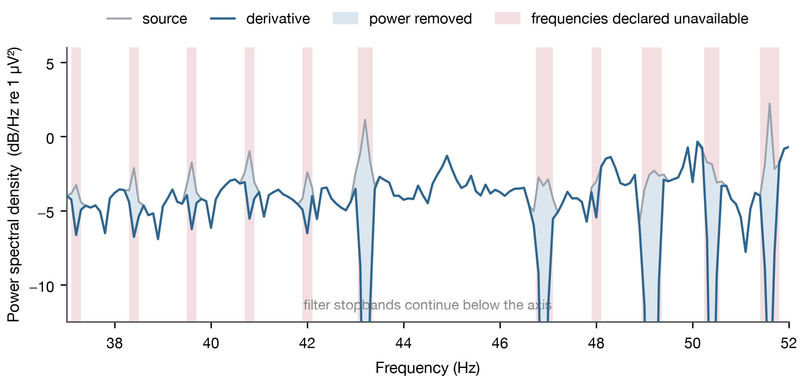

# decomb

<p align="center">
  
</p>

`decomb` detects and suppresses statistically supported narrow spectral lines in
continuous EEG. Each recording is fitted independently. All non-bad EEG channels are
tested as one multiplicity-controlled recording family; their supported intervals are
merged and the same filter is applied to every EEG channel. The result is written as a
BrainVision BIDS derivative with
measured stopbands, transition bands, removal rounds, and verification results. A single
recording is a complete valid input and no cohort catalogue is required.

## Problem statement

Residual periodic artifacts can remain in EEG acquired during or near fMRI after
gradient and pulse artifact correction [[1](#user-content-ref-1),
[2](#user-content-ref-2)]. Cryogenic pumps and scanner ventilation systems are reported
sources [[3](#user-content-ref-3), [4](#user-content-ref-4)]. Their frequencies can drift
within a recording and can occur as a harmonic series or as isolated narrowband lines.

The recording alone does not uniquely separate neural and artifactual contributions at
the same frequency. Source-separation methods require additional assumptions and cannot
establish unique recovery when those assumptions are unsupported
[[20](#user-content-ref-20)]. Filtering attenuates neural activity together with the
artifact and does not reconstruct the rejected signal [[6](#user-content-ref-6),
[21](#user-content-ref-21), [22](#user-content-ref-22)].

`decomb` therefore records every stopband and transition as unavailable for inference
and does not impute neural activity. Physical attribution requires independent evidence.
Source control remains preferable when the source is known
[[5](#user-content-ref-5)].

## Scope

Input recordings must use BrainVision format in an EEG-BIDS dataset
[[12](#user-content-ref-12), [14](#user-content-ref-14)]. Recording directories may contain
optional session and run entities. Channel metadata mismatches raise an error.

At least two non-bad channels typed as EEG are required for detection.
Those channels must contain finite values and at least three complete estimation windows
inside continuous acquisition spans. Windows never cross annotations whose descriptions
begin with
`edge` or `bad_acq_skip`. Every recording must also contain at least two annotations
whose description exactly matches `removal.scanner_trigger_event_name`; every interval
between those annotations must equal `removal.scanner_repetition_time_s` within half a
sample. When filtering is authorized, every continuous acquisition span must be at
least as long as the designed FIR; shorter spans fail because MNE warns that such a
filter is likely to distort the signal.

Detection tests the as-recorded non-bad EEG channels. This deliberately includes
common/reference-borne lines that remain visible in channel spectra. Changing the
acquisition reference can therefore change the evidence, and the derivative records the
tested reference rather than claiming reference invariance.

The method identifies narrow spectral structure. Broad rhythms and transient artifacts
require temporal or spatial methods [[7](#user-content-ref-7)]. A detected comb does not
identify its physical source.

## Installation

Python 3.11 or newer is required.

```bash
python3 -m venv .venv
source .venv/bin/activate
python3 -m pip install -e .
```

## Quick start

```bash
decomb diagnose --config decomb.yaml
decomb apply --config decomb.yaml
decomb verify --config decomb.yaml
decomb psd --config decomb.yaml
```

| Command | Operation |
| --- | --- |
| `diagnose` | Tests narrow spectral lines and writes the proposed filter plan |
| `apply` | Fits each recording, filters EEG channels, and writes the complete derivative |
| `verify` | Refits and replays every FIR round, then requires exact samples and a residual null |
| `psd` | Writes equal-recording cohort spectra before and after correction |

`apply` and `verify` require the complete discovered dataset. `diagnose` and `psd`
accept recording subsets. An existing output directory causes `apply` to stop.

## Configuration

The packaged configuration is
[`src/decomb/defaults.yaml`](src/decomb/defaults.yaml). Three settings define the
ordinary line test, and two recording-specific inputs pre-specify the scanner comb.

| Setting | Default | Function |
| --- | --- | --- |
| `removal.scanner_repetition_time_s` | 0.9 s | Scanner TR; fixes the comb fundamental at `1 / TR` |
| `removal.scanner_trigger_event_name` | `Volume/V  1` | Exact annotation name used to validate that TR |
| `removal.estimation_window_s` | 10.0 s | Ordinary-line stationarity interval and spectral resolution |
| `removal.familywise_error_rate` | 0.05 | Target error budget allocated across one recording's adaptive removal sequence |
| `removal.frequency_range_hz` | 0.0 to 100.0 Hz | Frequencies eligible for detection and filtering |
| `removal.comb_fundamental_hz` | null | Comb fundamental; null derives it from the TR above |

The default ordinary-line window gives Fourier bins separated by 0.1 Hz. Changing that
duration changes its frequency spacing; ordinary-line stopbands remain at least 0.25 Hz
wide. Scanner-comb localization remains fixed at 4 seconds. A supported scanner tooth
covers its fixed 1 Hz local-background neighborhood on each side, while prespecified
weak teeth retain the 0.25 Hz localization width. FIR selectivity remains fixed at the
54-second reference geometry. Thus scanner users need to provide only the TR and exact
trigger name; no harmonic count, fundamental, search radius, or filter width is tuned.

A periodic source does not have to run at the volume rate. `removal.comb_fundamental_hz`
declares its frequency directly when it does not: a cryogenic cold head at 72 cycles per
minute is 1.2 Hz, while a 0.9 s TR gives 1.1111 Hz, and a grid built on the wrong one
tests frequencies between the teeth. Left null the fundamental is derived from the TR, so
existing configurations are unchanged. The declared value must come from what the
hardware does rather than from a spectrum: fixing the grid before any spectrum is
inspected is what keeps the comb from being fished out of the data, and the trigger check
still validates the recording's timing either way. In this cohort the comb is at 1.200 Hz
in 88 of 90 recordings and the trigger-derived grid carries nothing; see
[`docs/artifact_survey.md`](docs/artifact_survey.md).

`paths.bids_root` identifies the input dataset. Output and report locations have
packaged defaults. Optional `frequency_bands` entries report unavailable and retained
bandwidth and do not affect detection.

Unknown and obsolete settings raise an error. Each recording clips the configured upper
frequency to values strictly below Nyquist.

## Methods

### Spectral estimation

The configured duration must be an exact whole number of samples at the recording's
sampling rate. Windows overlap by 50 percent, and the final window in each continuous
acquisition span is
aligned with that span's end. No estimation window crosses or includes samples marked
by MNE's `edge` or `bad_acq_skip` annotation prefixes.

The source recording is evaluated with two complementary line-shape tests. Thomson's
multitaper sinusoid F test follows MNE's `spectrum_fit` implementation: eight DPSS
tapers, a time-bandwidth product of four, alternating tapers for the sinusoidal estimate
and residual, and an F distribution with 2 and 14 degrees of freedom
[[9](#user-content-ref-9)]. It detects a phase-coherent sinusoid.

The persistent-peak test detects narrowband power whose phase or frequency modulation
prevents a sinusoid fit. From the 50-percent-overlapping 10-second windows, every fourth
window estimates a channel-specific, median-smoothed spectral background and the
intervening non-overlapping windows form a disjoint test sample. At each Fourier bin, a
three-bin target band is compared with equal-width symmetric flanking bands. Under the
local smooth-spectrum null, the target is uniquely largest with probability one third;
an exact one-sided binomial test measures its persistence. The two shape-test p-values
are Bonferroni-combined at each window, channel, and frequency. DC is excluded.

### Joint line and scanner-comb detection

Removal round `r` receives error rate `alpha / (r * (r + 1))`; each round splits that
rate equally between the ordinary-line and scanner-comb families. The ordinary family
uses one Holm correction across every as-recorded non-bad EEG channel, continuous
10-second
estimation window, and tested Fourier frequency in the recording. A frequency is
eligible only when its recording-family Holm-adjusted, shape-test-union p-value is below
the ordinary family's allocated rate. After the source round, refits use the Thomson
test alone because an earlier notch has deliberately changed the local peak geometry.

The scanner family is fixed before the spectrum is inspected. Its fundamental is exactly
`1 / TR`, after the configured event sequence passes the timing check above. A separate
4-second Thomson fit evaluates the nearest Fourier bin to each in-range integer harmonic.
Each harmonic is Bonferroni-corrected across its windows, channels, and the prespecified
harmonic grid. Each supported harmonic authorizes only its own 2.25 Hz
local-background envelope: the 0.25 Hz localization width plus the fixed 1 Hz
neighborhood on each side. Support at one tooth is never extrapolated to another: a tooth
that fails its own test is left in place, however many of its neighbors passed.
No unconfigured or data-inferred fundamental can authorize the plan.

The summable allocation bounds the nominal error budgets made available to the rounds.
It does not by itself prove exact post-selection null behavior after earlier
data-dependent filters. Complete-sequence calibration is therefore measured empirically
with mixed true/null simulations.
Supported intervals from all channels are merged into one recording plan and the
identical FIR is applied to every EEG channel, including channels marked bad, so a later
spatial transform cannot restore a component from an unfiltered channel. Recordings are
independent inferential families and channels are never pooled across the cohort.

If neither family is significant, that joint null result is recorded explicitly and the
recording is copied without filtering. A clean statistical outcome is valid and does not
abort diagnosis, application, or verification.

### Removal: subtract, then notch what survives

`apply` removes a line by fitting and subtracting it, and filters only the residue. Three
stages run before the derivative is written.

**Subtract.** A round-one fit selects targets: the statistically supported ordinary lines,
plus comb teeth standing more than 1 dB proud of their local background. MNE `spectrum_fit`
estimates one sinusoid's amplitude and phase per window by multitaper harmonic analysis and
removes exactly that [[9](#user-content-ref-9), [10](#user-content-ref-10),
[11](#user-content-ref-11)], so the frequency stays populated and whatever the sinusoid does
not describe survives. The fit window is twice the detection window, 20 s at the default
10 s, which halves the bandwidth each fit destroys without changing what detection sees.

**Notch the residue.** Detected bins closer than three Fourier bins are one physical line; a
group whose post-subtraction prominence still exceeds 2 dB is filtered across its whole span
plus 1.25 bins on each side [[6](#user-content-ref-6)]. Thresholding on the residual that
survives subtraction, rather than on prominence before it, is what makes the threshold
transfer between recordings.

**Converge.** The FIR rounds described below then run until fresh ordinary-line and
scanner-comb fits are both null.



**What the pipeline does.** Channel-mean power spectral density of sub-0010 run 1, shown over
37 to 52 Hz of the 1 to 100 Hz analysed range, in 0.1 Hz Welch bins from 10 s segments. Blue
shading is the power removed. Pink bands are the frequencies the manifest declares unavailable
for inference, and their regular 1.2 Hz spacing is the comb. A narrow band is a subtracted
line, costing two Fourier bins of the fit window on each side; a wide band is a filter
stopband with its transitions, where the spectrum is emptied and the trace leaves the axis.
Removal is bounded by the evidence, so the frequencies between the bands are unchanged.

Subtraction is not free. It removes whatever sits at the fitted frequency, neural activity
included, so each subtracted frequency declares an unavailable interval of two Fourier bins
of the fit window on each side. Those intervals merge with the FIR stopbands and their
transitions, and every manifest row carries the single recording-wide share that results.
`verify` re-derives both stages from the source before replaying them.

The residual stage is deliberately heuristic: it removes material the converged statistical
rounds would not, which is where its advantage on the comb comes from. Its constants are
measured on this cohort rather than tuned here, in
[`docs/removal_operating_point.md`](docs/removal_operating_point.md) and
[`docs/artifact_survey.md`](docs/artifact_survey.md).

### Stopbands and FIR filtering

Each ordinary-line stopband covers its statistically supported Fourier-bin positions,
expanded by 0.125 Hz on each side. Its minimum 0.25 Hz width removes the visible local
structure represented by an authorized line; a coarser configured Fourier bin makes the
minimum correspondingly wider. A statistically supported scanner harmonic uses the
2.25 Hz envelope above so its visible skirts are not left beside a deep central notch.
A prespecified tooth that carries no support of its own is not
notched at all. Stopbands are merged only when their FIR transitions
would overlap. Other unsupported frequencies stay in the passband.

The total transition bandwidth is fixed at `3.3 / 54 = 0.061111` Hz. MNE assigns half
of this width to each stopband edge, producing the selective 108-second Hamming FIR while
leaving the statistical estimation horizons independent. Merged stopbands are passed to
MNE `Raw.notch_filter` as one recording-wide plan for every EEG channel
[[10](#user-content-ref-10), [11](#user-content-ref-11)].

| Parameter | Value |
| --- | --- |
| `freqs` | Measured stopband centres |
| `notch_widths` | Measured stopband widths |
| `trans_bandwidth` | 0.061111 Hz total (0.030556 Hz per edge) |
| `method` | `fir` |
| `filter_length` | `auto` |
| `phase` | `zero` |
| `fir_window` | `hamming` |
| `fir_design` | `firwin` |
| `pad` | `reflect_limited` |
| `skip_by_annotation` | `edge`, `bad_acq_skip` |
| `n_jobs` | `-1` |

Each removal round is a zero-phase, noncausal FIR design with delay compensation. The
manifest records every round's exact sample count and measured response. Filtering stops
only when fresh ordinary-line and trigger-anchored scanner-harmonic fits are both null. A
supported plan whose filter changes no samples raises an error instead of being hidden by
an iteration limit.
A transition reaching zero frequency or Nyquist, or a continuous span shorter than the
FIR, raises an error
[[6](#user-content-ref-6)].

### Attenuation and verification

Stopband power is summed across frequency bins on the channel carrying ordinary-line
evidence, or across the equal-channel mean for recording-level scanner evidence. Source
and derivative spectra use the same complete Hamming windows used by
the boundary policy. The reported change is descriptive and no attenuation threshold
decides whether verification passes.

Verification confirms that scientific settings, library versions, and recording geometry
match the apply stage. Starting from the source recording, it refits and replays every
declared round and requires each Holm or scanner-comb authorization, supporting window,
channel count, trigger-anchored harmonic set, recording-wide stopband geometry, and joint
terminal null to reproduce the manifest. It then
applies the destination BrainVision calibration and float32 quantization. Every sample
must equal the written derivative exactly, and an independent fit of the written data must
also be null. A recording that starts null is reproduced unchanged.

Quality-control spectra use MNE `psd_array_welch` with detrended Hamming windows, whose
sidelobe behaviour bounds the spectral leakage between neighbouring bins
[[8](#user-content-ref-8)], and are
wrapped as MNE `SpectrumArray` objects for plotting [[18](#user-content-ref-18)]. Source
and derivative files use identical EEG channels, complete continuous-acquisition
windows, segment duration, 50 percent overlap, frequency range, and frequency grid. No
Welch window crosses an `edge` or includes a `bad_acq_skip` interval. Each recording
contributes one per-channel spectrum. For each same-named sensor, recordings in which
that sensor is marked bad are excluded before the remaining spectra are averaged in
linear power with equal recording weight. Every sensor with at least one good recording
remains visible, and both figures share one decibel scale.

### Validation scope

Null calibration used stationary Gaussian surrogates whose channel spectra match
median-smoothed real-recording periodograms. This deliberately line-free null tests the
implementation under a known stochastic model; it does not establish calibration for
arbitrary nonstationary, non-Gaussian EEG. The primary null result is the proportion of
recordings with at least one authorization. Channel-recording detection proportion is
reported only as a secondary descriptive metric.

Recovery uses a fixed 90-point factorial design independent of Decomb settings: three
frequencies across the analysis range, three component-to-background energy ratios, two
phases, and two
fixed physical drift magnitudes (0.05 and 0.2 Hz) or occupancies where applicable. The
complete target set must lie below the lowest Nyquist frequency in the cohort; an
incompatible cohort fails validation before calibration begins. Component amplitudes
are scaled from the surrogate background alone. Decomb settings and detections from the
real cohort do not define the benchmark. Persistent stationary and drifting injections
also record whether the full adaptive sequence authorizes any frequency outside the
known injected support.

## Outputs and provenance

The output follows EEG-BIDS and BIDS derivative conventions
[[12](#user-content-ref-12), [13](#user-content-ref-13),
[19](#user-content-ref-19)]. Corrected BrainVision triplets receive a `_desc-decomb`
entity. The derivative includes a stopband manifest, `dataset_description.json`, apply
and verification configurations, an independent verification table, and matched PSD
products. The manifest records the affected channel, every detected frequency,
Holm-input and Holm-adjusted p-values, supporting windows, per-channel
and total test counts, removal round, the recording-wide FIR response, attenuation,
the configured sequence-wide error rate, the allocated round error rate, terminal null,
and cumulative unavailable bandwidth. Floating-point geometry is written with 17
significant digits.

`diagnose` writes `model.tsv`, `detected_lines.tsv`, and `stopbands.tsv`. `apply` writes
`line_notch_manifest.tsv`, and `verify` writes `line_notch_verification.tsv`. `psd` writes
`psd_before.png` and `psd_after.png`, one line per sensor in position colours, and
`psd_before_declared.png` and `psd_after_declared.png`, which put the sensor mean and range
above the share of recordings that declared each frequency unavailable.

`apply` also writes two advisory tables. `comb_analysis_mask.tsv` lists every comb tooth in
the band where the comb was measured, at the width a subtracted tooth declares, whether or
not a given recording removed that tooth; `analysis_availability.tsv` gives each band's
retained share with and without that mask. Both are for downstream analysis only. Neither
describes the derivative: the manifest records what was destroyed, these record what an
analyst may additionally choose to distrust.

## Before and after

All 90 recordings, representing 12.09 hours of continuous acquisition after excluding
`bad_acq_skip` spans, measured with the Welch settings above. Each coloured trace is one
sensor's linear-power spectrum averaged equally across recordings in which that sensor
is not marked bad. Both MNE figures use the same recordings, channels, samples, and
decibel scale, so the only difference is the correction.


The terminal cumulative geometry in the 90-recording audit changes mean band availability
as follows. These percentages describe retained frequency bandwidth, not retained signal
power; each recording has equal weight.

| Band | Before availability | After availability | Made unavailable |
| --- | ---: | ---: | ---: |
| Delta | 100.000% | 98.778% | 1.222 percentage points |
| Theta | 100.000% | 99.943% | 0.057 percentage points |
| Alpha | 100.000% | 99.476% | 0.524 percentage points |
| Beta | 100.000% | 92.718% | 7.282 percentage points |
| Gamma | 100.000% | 77.812% | 22.188 percentage points |

These declare all three removal stages -- subtraction damage, residual stopbands and the
FIR cascade -- merged per recording. Gamma carries almost the whole cost, because that is
where the comb and the isolated lines are. An earlier notching-only configuration of this
pipeline retained 59.210% of gamma and 85.044% of alpha for the same cohort.

Two measurements set the current configuration.
[`docs/artifact_survey.md`](docs/artifact_survey.md) reports that the comb in this cohort
is at 1.200 Hz rather than the 1.1111 Hz the TR implies, so geometry anchored to the
trigger grid was spent on frequencies the artifact does not occupy; `removal.comb_fundamental_hz`
must be declared for the residual stage to test the grid the artifact actually occupies.
[`docs/removal_operating_point.md`](docs/removal_operating_point.md) derives the fit
window, the residual floor and the clustering gap from sweeps on these 90 recordings.

### Removal stays inside the bandwidth it declares

Availability only means something if removal is confined to the intervals the manifest
names. Measured on the difference between each source and its derivative, which is exactly
what was removed, over all 90 recordings:

| | mean | median | worst recording |
| --- | ---: | ---: | ---: |
| Removed energy inside the declared intervals | 99.975% | 99.976% | 99.954% |
| Power taken from a bin declared available, worst in the cohort | -- | -- | 0.670 dB |
| Bins declared available that lose more than 0.5 dB | -- | -- | 3 of 287,000 |

| Analytic bound, every filter the pipeline built | Value |
| --- | ---: |
| Maximum passband deviation | 0.027 dB |
| Minimum stopband attenuation | 50.6 dB |

The passband figure is a design-time property recorded for each filter in the manifest, not
an estimate: outside its stopband and transitions, an FIR built here cannot alter a frequency
by more than 0.027 dB. The subtraction stage is bounded empirically instead, and the two
bins it declares on each side are not spare padding. Halving them to one bin would raise
gamma availability from 77.8 to 82.8 percent, and 99.7 percent of the removed energy would
still fall inside the narrower declaration -- but the energy that escapes is concentrated
rather than spread. At one bin, 539 frequencies across the cohort lose more than 0.5 dB while
being declared available, and five recordings contain frequencies emptied almost entirely
under a declaration that calls them usable. At two bins that count is three, and the worst
is 0.670 dB. `studies/2026-08-19-arm-comparison/declared_width_safety.py` records the
comparison.

Spectral resolution decides this measurement and it is easy to get wrong. Differencing two
0.1 Hz-resolution spectra makes removal appear to leak, because a Welch estimate at that
resolution smears a narrow removal across neighbouring bins; the same removal is 73 percent
contained at 10 s segments and 100 percent contained once the segment is long enough to
resolve it. The figures above use the difference signal and segments twice the subtraction
fit window, which puts eight bins across a declared interval, so they measure the removal
rather than the estimator. `verify` reports the same quantity per recording in
`removed_energy_inside_declared_share`.

The cost of this choice is that the comb is left at its background rather than driven
below it: notching on the corrected 1.2 Hz grid reaches -6.80 dB where subtraction reaches
about -0.3 dB, at alpha 0.744 and gamma 0.556. That trade is a study-level decision and is
recorded in the same document.

## Cohort run

`decomb diagnose | apply | verify | psd` over all 90 recordings, 12.09 hours of continuous
acquisition, 2026-08-20.

| | |
| --- | ---: |
| Recordings processed | 90 / 90 |
| Lines subtracted per recording | 149 (61 to 201) |
| Residual stopbands per recording | 7.3 (0 to 20) |
| FIR rounds to a terminal null | 2.88 (at most 5) |
| Excluded zones per recording | 50, covering 18.6 Hz of 99 Hz |
| **Derivative reproduced from its declared provenance** | **90 / 90, 0.000e+00 V** |
| **Removed energy inside the declared bandwidth** | **99.975% mean, 99.954% worst** |
| Recordings whose confinement falls below 99% | 0 |

| Band | Availability after removal |
| --- | ---: |
| Delta | 98.778% |
| Theta | 99.943% |
| Alpha | 99.476% |
| Beta | 92.718% |
| Gamma | 77.812% |

`verify` refits every stage from the source, replays subtraction, the residual notches and
the FIR cascade, and requires the result to equal the written derivative sample for sample.
It reports the confinement figure per recording in `removed_energy_inside_declared_share`.
The band figures are computed independently by `psd` from the derivative itself and agree
with the manifest's declared shares to three decimals.

### The spectrum before and after, and what removal declares unavailable


Written by the `psd` stage on every run, as `psd_before_declared.png` and
`psd_after_declared.png`. Cohort spectra over all 90 recordings, each weighted equally. The line is the mean across 63 sensors and
the band is their full range. The panel beneath gives, for each frequency, the percentage of
recordings whose manifest declares it unavailable for inference.

The comb is unmistakable in the source as a regular 1.2 Hz picket above 20 Hz, with the pump
line near 57 Hz and mains at 60 Hz standing well clear of it. In the derivative the picket is
gone and the spectrum falls smoothly; what remains at the declared frequencies are the
notches, which read as narrow dips rather than peaks.

The lower panel is the honest cost, and it is not uniform. Below 20 Hz almost nothing is
declared, because the residual comb stage starts there and few ordinary lines are supported
lower -- which is why alpha and theta retain above 99 percent. Above it the declaration
follows the artifact: teeth reaching 100 percent are frequencies every recording had to give
up, while the many partial bars are lines supported in some recordings and not others. Across
the 1 to 100 Hz range, 33 percent of frequencies are declared by no recording at all and only
3 percent by all 90.

## Software and testing

Version `0.2.0` is installable with Python 3.11 or newer and the lower dependency bounds
declared in [`pyproject.toml`](pyproject.toml). The exact environment used for the current
90-recording validation is published in
[`requirements/validated.txt`](requirements/validated.txt): Python 3.12.13, NumPy 2.5.2,
SciPy 1.18.0, MNE-Python 1.12.1, MNE-BIDS 0.19.0, pandas 3.0.5, PyYAML 6.0.3,
Matplotlib 3.11.1, and pybv 0.8.1. The validated file freezes every installed dependency
and verification tool on macOS arm64 without widening the general install metadata
[[10](#user-content-ref-10),
[11](#user-content-ref-11), [14](#user-content-ref-14), [15](#user-content-ref-15),
[16](#user-content-ref-16), [17](#user-content-ref-17)].

```bash
.venv/bin/pytest -q
.venv/bin/ruff check src tests
```

## References

1. <a name="ref-1"></a>Allen PJ, Josephs O, Turner R. A method for removing imaging artifact from continuous
   EEG recorded during functional MRI. *NeuroImage*. 2000, 12, 230 to 239.
   [DOI](https://doi.org/10.1006/nimg.2000.0599)
2. <a name="ref-2"></a>Niazy RK, Beckmann CF, Iannetti GD, Brady JM, Smith SM. Removal of FMRI environment
   artifacts from EEG data using optimal basis sets. *NeuroImage*. 2005, 28, 720 to 737.
   [DOI](https://doi.org/10.1016/j.neuroimage.2005.06.067)
3. <a name="ref-3"></a>Rothlübbers S, Relvas V, Leal A, Murta T, Lemieux L, Figueiredo P. Characterisation
   and reduction of the EEG artefact caused by the helium cooling pump in the MR
   environment. *Brain Topography*. 2015, 28, 208 to 220.
   [DOI](https://doi.org/10.1007/s10548-014-0408-0)
4. <a name="ref-4"></a>Nierhaus T, Gundlach C, Goltz D, et al. Internal ventilation system of MR scanners
   induces specific EEG artifact during simultaneous EEG-fMRI. *NeuroImage*. 2013, 74,
   70 to 76. [DOI](https://doi.org/10.1016/j.neuroimage.2013.02.016)
5. <a name="ref-5"></a>Mullinger KJ, Castellone P, Bowtell R. Best current practice for obtaining high quality
   EEG data during simultaneous fMRI. *Journal of Visualized Experiments*. 2013, 76,
   e50283. [DOI](https://doi.org/10.3791/50283)
6. <a name="ref-6"></a>Widmann A, Schröger E, Maess B. Digital filter design for electrophysiological data,
   a practical approach. *Journal of Neuroscience Methods*. 2015, 250, 34 to 46.
   [DOI](https://doi.org/10.1016/j.jneumeth.2014.08.002)
7. <a name="ref-7"></a>Bullock M, Jackson GD, Abbott DF. Artifact reduction in simultaneous EEG-fMRI, a
   systematic review of methods and contemporary usage. *Frontiers in Neurology*. 2021,
   12, 622719. [DOI](https://doi.org/10.3389/fneur.2021.622719)
8. <a name="ref-8"></a>Harris FJ. On the use of windows for harmonic analysis with the discrete Fourier
   transform. *Proceedings of the IEEE*. 1978, 66, 51 to 83.
   [DOI](https://doi.org/10.1109/PROC.1978.10837)
9. <a name="ref-9"></a>Thomson DJ. Spectrum estimation and harmonic analysis. *Proceedings of the IEEE*.
   1982, 70, 1055 to 1096. [DOI](https://doi.org/10.1109/PROC.1982.12433)
10. <a name="ref-10"></a>Gramfort A, Luessi M, Larson E, et al. MNE software for processing MEG and EEG data.
    *NeuroImage*. 2014, 86, 446 to 460.
    [DOI](https://doi.org/10.1016/j.neuroimage.2013.10.027)
11. <a name="ref-11"></a>Gramfort A, Luessi M, Larson E, et al. MEG and EEG data analysis with MNE-Python.
    *Frontiers in Neuroscience*. 2013, 7, 267.
    [DOI](https://doi.org/10.3389/fnins.2013.00267)
12. <a name="ref-12"></a>Pernet CR, Appelhoff S, Gorgolewski KJ, et al. EEG-BIDS, an extension to the Brain
    Imaging Data Structure for electroencephalography. *Scientific Data*. 2019, 6, 103.
    [DOI](https://doi.org/10.1038/s41597-019-0104-8)
13. <a name="ref-13"></a>Gorgolewski KJ, Auer T, Calhoun VD, et al. The Brain Imaging Data Structure, a format
    for organizing and describing outputs of neuroimaging experiments. *Scientific
    Data*. 2016, 3, 160044. [DOI](https://doi.org/10.1038/sdata.2016.44)
14. <a name="ref-14"></a>Appelhoff S, Sanderson M, Brooks TL, et al. MNE-BIDS, organizing
    electrophysiological data into the BIDS format and facilitating their analysis.
    *Journal of Open Source Software*. 2019, 4, 1896.
    [DOI](https://doi.org/10.21105/joss.01896)
15. <a name="ref-15"></a>Harris CR, Millman KJ, van der Walt SJ, et al. Array programming with NumPy. *Nature*.
    2020, 585, 357 to 362. [DOI](https://doi.org/10.1038/s41586-020-2649-2)
16. <a name="ref-16"></a>Virtanen P, Gommers R, Oliphant TE, et al. SciPy 1.0, fundamental algorithms for
    scientific computing in Python. *Nature Methods*. 2020, 17, 261 to 272.
    [DOI](https://doi.org/10.1038/s41592-019-0686-2)
17. <a name="ref-17"></a>Hunter JD. Matplotlib, a 2D graphics environment. *Computing in Science and
    Engineering*. 2007, 9, 90 to 95.
    [DOI](https://doi.org/10.1109/MCSE.2007.55)
18. <a name="ref-18"></a>Welch P. The use of fast Fourier transform for the estimation of power spectra, a
    method based on time averaging over short, modified periodograms. *IEEE Transactions
    on Audio and Electroacoustics*. 1967, 15, 70 to 73.
    [DOI](https://doi.org/10.1109/TAU.1967.1161901)
19. <a name="ref-19"></a>BIDS Contributors. BIDS Derivatives. *Brain Imaging Data Structure specification*.
    Version 1.11.1.
    [Specification](https://bids-specification.readthedocs.io/en/stable/derivatives/introduction.html)
20. <a name="ref-20"></a>Hyvärinen A, Oja E. Independent component analysis, algorithms and applications.
    *Neural Networks*. 2000, 13, 411 to 430.
    [DOI](https://doi.org/10.1016/S0893-6080(00)00026-5)
21. <a name="ref-21"></a>de Cheveigné A, Nelken I. Filters, when, why, and how not to use them. *Neuron*.
    2019, 102, 280 to 293.
    [DOI](https://doi.org/10.1016/j.neuron.2019.02.039)
22. <a name="ref-22"></a>Leske S, Dalal SS. Reducing power line noise in EEG and MEG data via spectrum
    interpolation. *NeuroImage*. 2019, 189, 763 to 776.
    [DOI](https://doi.org/10.1016/j.neuroimage.2019.01.026)
MNE implementation details are documented in the
[notch-filter API](https://mne.tools/stable/generated/mne.filter.notch_filter.html), the
[filtering methods tutorial](https://mne.tools/stable/auto_tutorials/preprocessing/25_background_filtering.html),
and the
[Welch PSD API](https://mne.tools/stable/generated/mne.time_frequency.psd_array_welch.html).

## License

BSD 3-Clause. See [`LICENSE`](LICENSE).
