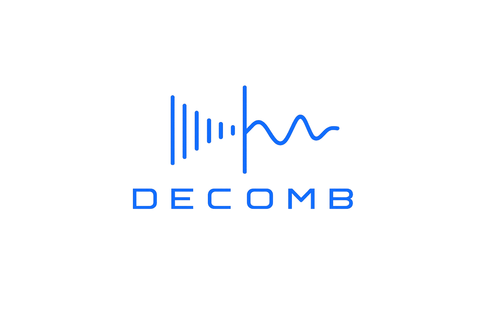
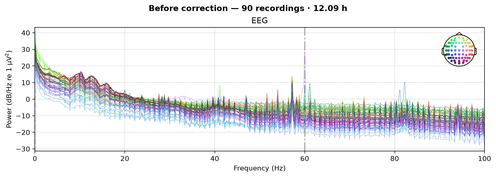
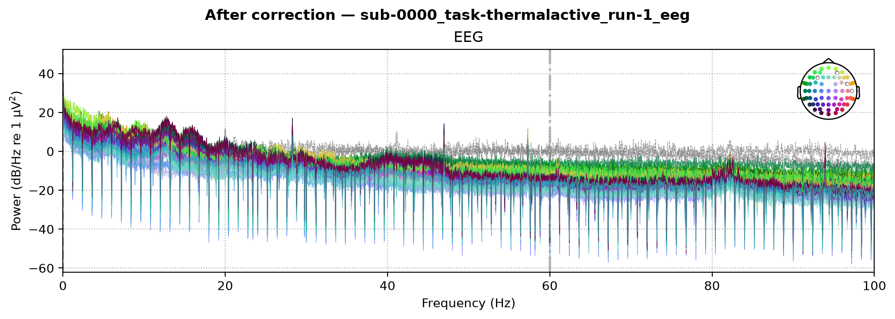
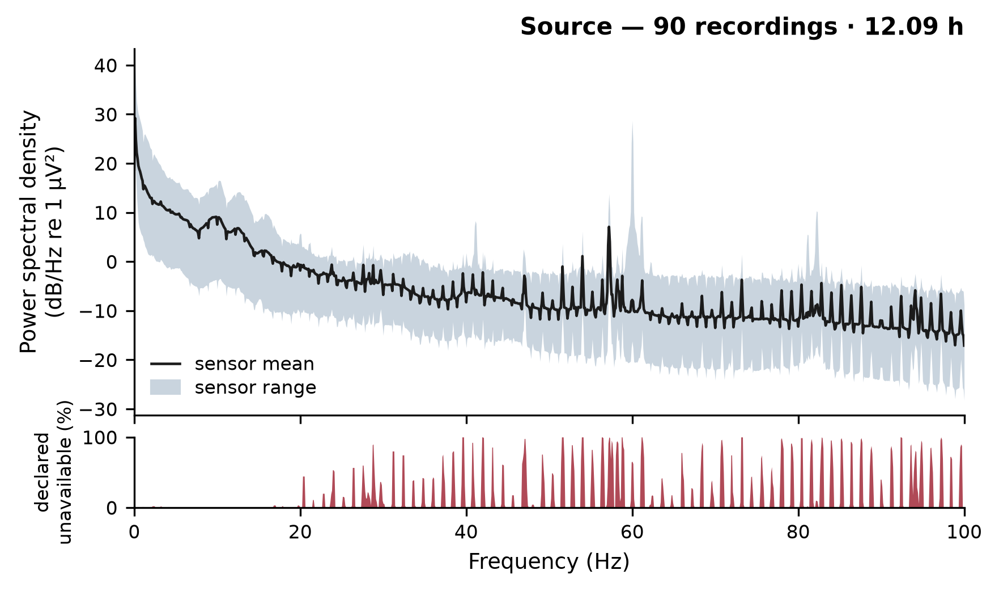
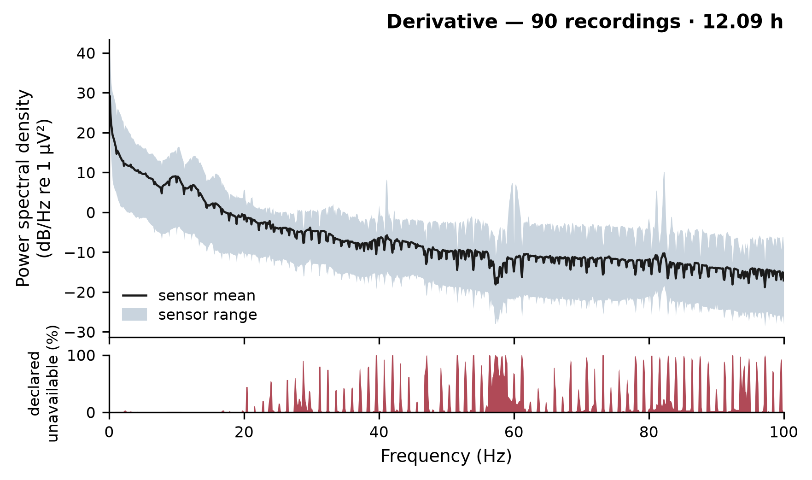

# decomb

<p align="center">
  
</p>

`decomb` detects and removes supported narrow spectral lines in continuous EEG. It
analyzes each recording independently, subtracts authorized sinusoidal components from
non-bad EEG channels, and applies one residual FIR plan to every EEG channel. `apply`
writes a BrainVision BIDS derivative with provenance and verification results. Frequencies
removed by either stage are declared unavailable for downstream inference.

## Use case and limits

Periodic artifacts can remain after gradient and pulse artifact correction in simultaneous
EEG-fMRI [[1](#user-content-ref-1), [2](#user-content-ref-2)]. Scanner pumps, ventilation
systems, and other periodic hardware sources can produce drifting lines, isolated lines,
or harmonic structure [[3](#user-content-ref-3), [4](#user-content-ref-4)].

The recording alone cannot establish whether activity at a removed frequency was neural
or artifactual [[20](#user-content-ref-20)]. Subtraction and filtering can both remove
neural activity at the same frequency. Neither reconstructs the rejected signal
[[6](#user-content-ref-6), [21](#user-content-ref-21), [22](#user-content-ref-22)]. Broad
rhythms and transient or spatial artifacts require other methods [[7](#user-content-ref-7)].
Source control remains preferable when the source is known [[5](#user-content-ref-5)].

## Input requirements

Input recordings must be BrainVision EEG in an EEG-BIDS dataset
[[12](#user-content-ref-12), [14](#user-content-ref-14)]. Session and run entities are
supported. Channel metadata mismatches and invalid recording geometry fail before
processing.

Each recording needs at least two non-bad EEG channels with finite data and enough
continuous samples for the configured estimation windows. Windows do not cross `edge` or
`bad_acq_skip` annotations. Scanner-trigger annotations must match the configured name
and repetition time. Continuous spans shorter than the designed FIR are rejected.

Each recording is its own inferential family. A single recording is sufficient for
`diagnose`; `apply` and `verify` operate on the complete discovered dataset, while
`diagnose` and `psd` can restrict their analysis with `--subjects`.

## Installation

Python 3.11 or newer is required.

```bash
python3 -m venv .venv
source .venv/bin/activate
python3 -m pip install -e .
```

The scientific stack uses NumPy, SciPy, and Matplotlib [[15](#user-content-ref-15),
[16](#user-content-ref-16), [17](#user-content-ref-17)].

## Workflow

Set `paths.bids_root` in `decomb.yaml`. Other settings inherit the packaged defaults.

```bash
decomb diagnose --config decomb.yaml
decomb apply --config decomb.yaml
decomb verify --config decomb.yaml
decomb psd --config decomb.yaml
```

| Command | Purpose |
| --- | --- |
| `diagnose` | Detect supported lines and write a diagnostic model |
| `apply` | Subtract authorized lines, notch proud residuals, and write the derivative |
| `verify` | Reproduce both removal stages and verify the written samples |
| `psd` | Compare source and derivative spectra |

`apply` refuses to use an existing output directory. Run `diagnose` before `apply`, then
run `verify` and `psd` after the derivative has been written.

## Configuration

The packaged configuration is [`src/decomb/defaults.yaml`](src/decomb/defaults.yaml).
The settings normally relevant to a user are:

| Setting | Default | Purpose |
| --- | --- | --- |
| `paths.bids_root` | `data/bids` | Source BrainVision BIDS dataset |
| `removal.scanner_repetition_time_s` | `0.9` | Scanner repetition time in seconds |
| `removal.scanner_trigger_event_name` | `Volume/V  1` | Exact annotation used to validate scanner timing |
| `removal.comb_fundamental_hz` | `null` | Known source frequency; null derives it from the scanner timing |
| `removal.estimation_window_s` | `10.0` | Stationarity interval for ordinary-line detection |
| `removal.familywise_error_rate` | `0.05` | Initial recording-level error budget |
| `removal.frequency_range_hz` | `[0.0, 100.0]` | Detection and filtering range before Nyquist clipping |
| `execution.n_jobs` | `-1` | Worker count; changes speed, not results |

The scanner repetition time and exact trigger name validate recording timing. Set
`removal.comb_fundamental_hz` when independent hardware information gives a periodic source
frequency different from the scanner volume rate. The frequency is never estimated from
the EEG. Unknown settings raise an error. The configured upper frequency is clipped to
remain below each recording's Nyquist frequency.

## Method

Continuous acquisition spans are analyzed in overlapping windows. MNE's multitaper
sinusoid F test identifies phase-coherent lines [[9](#user-content-ref-9)]. A complementary
persistence test detects narrowband peaks whose phase or frequency changes prevent a
sinusoid fit. Initial line and scanner-harmonic evidence is controlled within each
recording before removal targets are authorized [[23](#user-content-ref-23)].

Authorized ordinary lines and comb teeth that exceed the predeclared candidate floor are
fit with MNE multitaper sinusoid estimates and subtracted from non-bad EEG channels
[[9](#user-content-ref-9), [10](#user-content-ref-10), [11](#user-content-ref-11)]. The
default subtraction fit uses a 20-second window while detection uses 10 seconds. The
subtracted frequencies remain populated by whatever the sinusoid fit does not explain.

The residual spectrum is then tested once. Residual candidates above the 2 dB local
prominence threshold are clustered when they are within three Fourier bins. Each retained
cluster receives one stopband that includes its measured span and its edge margin. There is
no terminal cascade after this threshold FIR stage [[6](#user-content-ref-6)].

The same residual FIR plan is applied to every EEG channel, including channels marked bad.
It uses MNE's `Raw.notch_filter` with a zero-phase Hamming `firwin` design, automatic filter
length, reflect-limited padding, and annotation-aware processing [[10](#user-content-ref-10),
[11](#user-content-ref-11)]. Unsupported frequencies remain in the passband. A recording
with no subtraction target or residual stopband is copied unchanged.

Verification starts from the source recording, re-runs the authorization and subtraction
decisions, re-derives the residual stopbands, and checks the exact written samples. `psd`
uses matched Welch spectra with Hamming windows for source and derivative files, equal
recording weight, and a shared decibel scale [[8](#user-content-ref-8),
[18](#user-content-ref-18)].

## Outputs

`diagnose` writes `model.tsv`, `detected_lines.tsv`, `stopbands.tsv`, and the effective
configuration used for the run.

`apply` writes corrected BrainVision triplets with the `_desc-decomb` entity, a BIDS
`dataset_description.json`, and the manifest and advisory tables required by the BIDS
derivative conventions [[13](#user-content-ref-13), [19](#user-content-ref-19)]. It writes
`line_notch_manifest.tsv`, `comb_analysis_mask.tsv`,
`analysis_availability.tsv`, and the effective configuration. The manifest distinguishes
subtracted frequencies from residual-notched stopbands and records their evidence,
geometry, attenuation, and cumulative unavailable bandwidth. The two analysis tables are
advisory downstream masks and do not describe the derivative.

`verify` writes `line_notch_verification.tsv` with replay results. `psd` writes
`psd_before.png`, `psd_after.png`, `psd_before_declared.png`, and
`psd_after_declared.png`.

## Example result

These figures show the same EEG cohort before and after the threshold-stop correction.
Both use the same recordings, channels, samples, and decibel scale.









The example audit contains 90 recordings and 12.09 hours of continuous acquisition.
Removed frequency intervals are unavailable for inference, so downstream analyses should
account for the cumulative manifest geometry.

### Filtering performance

The threshold-stop method retained more gamma bandwidth than the retired terminal
cascade without a measurable cohort-level comb penalty. Availability is the share of
gamma-frequency bins not declared unavailable; it is not retained signal power.

| Recording coverage | Terminal cascade | Threshold stop |
| --- | ---: | ---: |
| 100% common | 29.2% | 58.7% |
| At least 95% | 57.8% | 65.6% |
| At least 90% | 62.8% | 68.5% |
| Mean per recording | 77.8% | 80.7% |

Six recordings were used for method development and 84 for the held-out comparison.
The paired comb difference had a median of 0.000 dB and a participant-level bootstrap
95% interval from -0.001 to +0.013 dB; the largest threshold-stop residual was +0.48 dB.
Across all 90 recordings, at least 99.95% of removed spectral energy lay inside the
manifest-declared unavailable intervals in every recording (median 99.97%). Verification
reproduced every written sample exactly (maximum deviation 0 V). These internal results
do not establish performance on an independent dataset.

## References and further reading

1. <a name="ref-1"></a>Allen PJ, Josephs O, Turner R. A method for removing imaging artifact from continuous
   EEG recorded during functional MRI. *NeuroImage*. 2000, 12, 230 to 239.
   [DOI](https://doi.org/10.1006/nimg.2000.0599)
2. <a name="ref-2"></a>Niazy RK, Beckmann CF, Iannetti GD, Brady JM, Smith SM. Removal of fMRI environment
   artifacts from EEG data using optimal basis sets. *NeuroImage*. 2005, 28, 720 to 737.
   [DOI](https://doi.org/10.1016/j.neuroimage.2005.06.067)
3. <a name="ref-3"></a>Rothlübbers S, Relvas V, Leal A, Murta T, Lemieux L, Figueiredo P. Characterisation
   and reduction of the EEG artefact caused by the helium cooling pump in the MR environment.
   *Brain Topography*. 2015, 28, 208 to 220. [DOI](https://doi.org/10.1007/s10548-014-0408-0)
4. <a name="ref-4"></a>Nierhaus T, Gundlach C, Goltz D, et al. Internal ventilation system of MR scanners
   induces specific EEG artifact during simultaneous EEG-fMRI. *NeuroImage*. 2013, 74,
   70 to 76. [DOI](https://doi.org/10.1016/j.neuroimage.2013.02.016)
5. <a name="ref-5"></a>Mullinger KJ, Castellone P, Bowtell R. Best current practice for obtaining high quality
   EEG data during simultaneous fMRI. *Journal of Visualized Experiments*. 2013, 76,
   e50283. [DOI](https://doi.org/10.3791/50283)
6. <a name="ref-6"></a>Widmann A, Schröger E, Maess B. Digital filter design for electrophysiological data,
   a practical approach. *Journal of Neuroscience Methods*. 2015, 250, 34 to 46.
   [DOI](https://doi.org/10.1016/j.jneumeth.2014.08.002)
7. <a name="ref-7"></a>Bullock M, Jackson GD, Abbott DF. Artifact reduction in simultaneous EEG-fMRI, a
   systematic review of methods and contemporary usage. *Frontiers in Neurology*. 2021,
   12, 622719. [DOI](https://doi.org/10.3389/fneur.2021.622719)
8. <a name="ref-8"></a>Harris FJ. On the use of windows for harmonic analysis with the discrete Fourier
   transform. *Proceedings of the IEEE*. 1978, 66, 51 to 83.
   [DOI](https://doi.org/10.1109/PROC.1978.10837)
9. <a name="ref-9"></a>Thomson DJ. Spectrum estimation and harmonic analysis. *Proceedings of the IEEE*.
   1982, 70, 1055 to 1096. [DOI](https://doi.org/10.1109/PROC.1982.12433)
10. <a name="ref-10"></a>Gramfort A, Luessi M, Larson E, et al. MNE software for processing MEG and EEG data.
    *NeuroImage*. 2014, 86, 446 to 460. [DOI](https://doi.org/10.1016/j.neuroimage.2013.10.027)
11. <a name="ref-11"></a>Gramfort A, Luessi M, Larson E, et al. MEG and EEG data analysis with MNE-Python.
    *Frontiers in Neuroscience*. 2013, 7, 267. [DOI](https://doi.org/10.3389/fnins.2013.00267)
12. <a name="ref-12"></a>Pernet CR, Appelhoff S, Gorgolewski KJ, et al. EEG-BIDS, an extension to the Brain
    Imaging Data Structure for electroencephalography. *Scientific Data*. 2019, 6, 103.
    [DOI](https://doi.org/10.1038/s41597-019-0104-8)
13. <a name="ref-13"></a>Gorgolewski KJ, Auer T, Calhoun VD, et al. The Brain Imaging Data Structure, a format
    for organizing and describing outputs of neuroimaging experiments. *Scientific Data*.
    2016, 3, 160044. [DOI](https://doi.org/10.1038/sdata.2016.44)
14. <a name="ref-14"></a>Appelhoff S, Sanderson M, Brooks TL, et al. MNE-BIDS, organizing electrophysiological
    data into the BIDS format and facilitating their analysis. *Journal of Open Source
    Software*. 2019, 4, 1896. [DOI](https://doi.org/10.21105/joss.01896)
15. <a name="ref-15"></a>Harris CR, Millman KJ, van der Walt SJ, et al. Array programming with NumPy. *Nature*.
    2020, 585, 357 to 362. [DOI](https://doi.org/10.1038/s41586-020-2649-2)
16. <a name="ref-16"></a>Virtanen P, Gommers R, Oliphant TE, et al. SciPy 1.0, fundamental algorithms for
    scientific computing in Python. *Nature Methods*. 2020, 17, 261 to 272.
    [DOI](https://doi.org/10.1038/s41592-019-0686-2)
17. <a name="ref-17"></a>Hunter JD. Matplotlib, a 2D graphics environment. *Computing in Science and
    Engineering*. 2007, 9, 90 to 95. [DOI](https://doi.org/10.1109/MCSE.2007.55)
18. <a name="ref-18"></a>Welch P. The use of fast Fourier transform for the estimation of power spectra, a
    method based on time averaging over short, modified periodograms. *IEEE Transactions
    on Audio and Electroacoustics*. 1967, 15, 70 to 73. [DOI](https://doi.org/10.1109/TAU.1967.1161901)
19. <a name="ref-19"></a>BIDS Contributors. BIDS Derivatives. *Brain Imaging Data Structure specification*.
    Version 1.11.1. [Specification](https://bids-specification.readthedocs.io/en/stable/derivatives/introduction.html)
20. <a name="ref-20"></a>Hyvärinen A, Oja E. Independent component analysis, algorithms and applications.
    *Neural Networks*. 2000, 13, 411 to 430. [DOI](https://doi.org/10.1016/S0893-6080(00)00026-5)
21. <a name="ref-21"></a>de Cheveigné A, Nelken I. Filters, when, why, and how not to use them. *Neuron*.
    2019, 102, 280 to 293. [DOI](https://doi.org/10.1016/j.neuron.2019.02.039)
22. <a name="ref-22"></a>Leske S, Dalal SS. Reducing power line noise in EEG and MEG data via spectrum
    interpolation. *NeuroImage*. 2019, 189, 763 to 776. [DOI](https://doi.org/10.1016/j.neuroimage.2019.01.026)
23. <a name="ref-23"></a>Holm S. A simple sequentially rejective multiple test procedure. *Scandinavian Journal
    of Statistics*. 1979, 6, 65 to 70. [JSTOR](https://www.jstor.org/stable/4615733)

Implementation details are available in the MNE
[notch-filter API](https://mne.tools/stable/generated/mne.filter.notch_filter.html) and
[filtering tutorial](https://mne.tools/stable/auto_tutorials/preprocessing/25_background_filtering.html).

## License

BSD 3-Clause. See [`LICENSE`](LICENSE).
