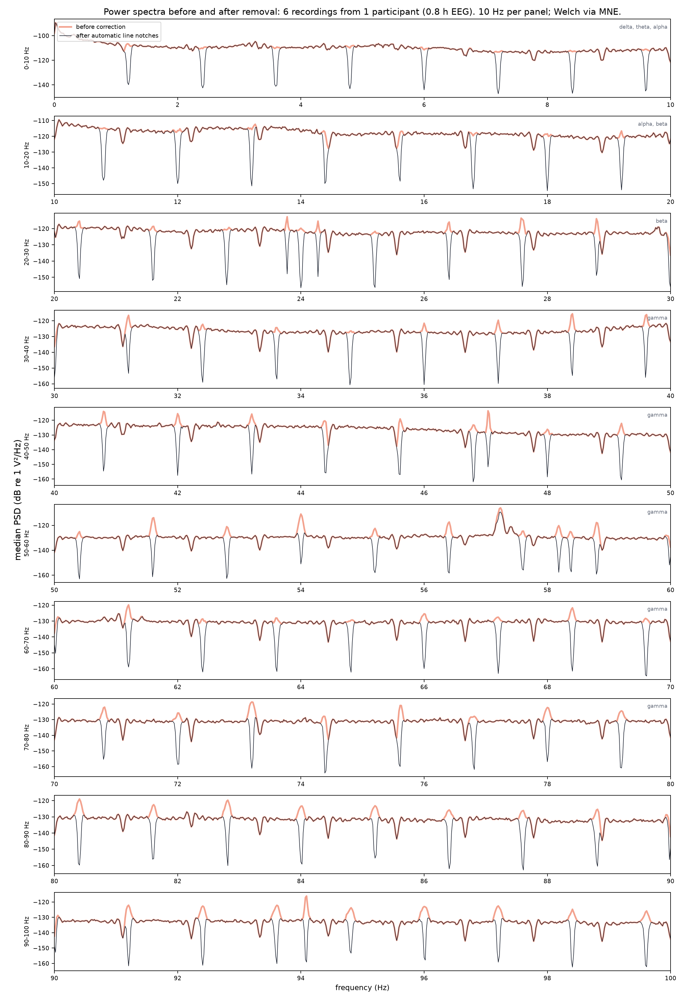

# decomb

<p align="center">
  
</p>

`decomb` is research software for automatic, auditable removal of narrowband EEG
artifacts. It discovers a recording-specific harmonic comb without a nominal frequency,
authorizes every integer multiple in the configured frequency range, and separately
detects resolution-limited isolated lines. It writes a BrainVision BIDS derivative plus
the exact frequency intervals that are unavailable for inference.

The central limitation is explicit: neural and artifactual activity at the same frequency
are not identifiable from one recording alone. `decomb` removes contaminated intervals;
it does not claim to reconstruct neural signal inside them.

## Abstract

The primary use case is continuous EEG acquired during or near fMRI after established
gradient- and pulse-artifact correction [[1](#references), [2](#references)]. Residual
MR-environment sources can produce repeated spectral peaks, including cryogenic-pump and
ventilation artifacts [[3](#references), [4](#references)]. A regular comb is evidence of
spectral structure, not proof of a physical source; source control remains preferable
whenever possible [[5](#references)].

The pipeline performs per-recording model selection, complete harmonic enumeration,
time-localized frequency tracking, isolated-line shape testing, finite-width FIR notch
construction, atomic BIDS writing, disk read-back, and independent spectral verification.
It does not replace gradient or ballistocardiographic correction. Broad rhythms and
transient artifacts are outside the scope of frequency notching, and filter effects must
be reported with the downstream analysis [[6](#references), [7](#references)].

Scanner triggers and scanner-clock annotations are neither read nor required. The method
uses only the EEG recording and its standard BIDS metadata.

## Installation

```bash
python -m venv .venv
source .venv/bin/activate
pip install -e .
```

Python 3.11 or newer is required.

## Configuration

The public correction has only two scientific settings: the stationarity horizon and the
frequency range eligible for detection and removal. The defaults are 54 seconds and
0–100 Hz. Everything else—Hann overlap, spectral resolution, localization uncertainty,
notch width, FIR transition width, parallelism, verification geometry, and PSD
geometry—is derived.

```yaml
paths:
  bids_root: /data/study/bids
  output_root: /data/study/bids_decombed

removal:
  estimation_window_s: 54.0
  frequency_range_hz: [0.0, 100.0]
```

Only `paths.bids_root` is required in practice: the output and report paths and both
correction settings have packaged defaults. Unknown or obsolete keys are errors. There
are no task, paradigm, participant, scanner, nominal-comb, amplitude-threshold, or
manual-harmonic settings in the implementation.

The 54-second window is the remaining experimental choice because stationarity cannot be
inferred without defining a time scale. It gives DFT spacing
$\Delta f=1/54=0.018519$ Hz and Hann half-power resolution
$r=1.4382/54=0.026633$ Hz. Users may change it when their scientific stationarity
assumption differs. The frequency range may be narrowed for a study but cannot exceed
100 Hz.

Optional `frequency_bands` entries name study bands for retained/unavailable bandwidth
reporting only. They never influence detection or filtering.

## Workflow

```bash
decomb diagnose --config decomb.yaml
decomb apply --config decomb.yaml
decomb verify --config decomb.yaml
decomb psd --config decomb.yaml
```

- `diagnose` fits every requested recording without changing data and writes the selected
  comb, isolated-line evidence, and planned intervals.
- `apply` refits every recording, writes a complete derivative through an atomic staging
  directory, and reads each BrainVision file back from disk.
- `verify` reconstructs the immutable FIR plan from the derivative manifest and measures
  the delivered files without refitting targets.
- `psd` computes matched before/after Welch spectra with MNE and generates cohort,
  frequency-panel, and per-recording figures.

`apply` and `verify` always operate on the complete discovered dataset. A subset cannot be
published as though it certified the whole derivative.

## Method

### Spectral estimate

Let $x[n]$ be one EEG channel in a window, $f_s$ the sampling frequency,
$N$ the number of samples, $T=N/f_s$, and $w[n]$ a Hann taper. The one-sided density is

$$
S(f_k)=\frac{c_k}{f_s\sum_n w^2[n]}
\left|\sum_{n=0}^{N-1}w[n]x[n]e^{-2\pi i kn/N}\right|^2,
\qquad f_k=\frac{k f_s}{N},
$$

where $c_k=2$ except at DC and Nyquist. Channels are summarized by their median. The
full-recording estimate is the mean window power followed by the channel median. In
decibels, $X(f)=10\log_{10}S(f)$. Peak positions are refined below the FFT grid with a
three-point parabola. The Hann half-power resolution is $r=1.4382/T$ [[8](#references)].

### Threshold-free comb selection

Candidate fundamentals are searched exhaustively from $2r$ to one quarter of the upper
analysis edge; four observable multiples are the minimum identifiable grid. For candidate
$f_0$, let

$$
\mathcal K(f_0)=\left\{k\in\mathbb N:
f_{\min}\le kf_0\le f_{\max}\right\}.
$$

At every candidate multiple, the integer-grid contrast against the halfway positions is

$$
d_k=X(kf_0)-\frac{X(kf_0-f_0/2)+X(kf_0+f_0/2)}{2}.
$$

The null model fixes the mean contrast at zero. The comb model estimates one positive
mean $\bar d$. With $K=|\mathcal K|$, residual sums $R_0=\sum_k d_k^2$ and
$R_1=\sum_k(d_k-\bar d)^2$, and $M$ distinguishable candidate grids, the evidence is

$$
\Delta\mathrm{BIC}=K\log\!\left(\frac{R_1}{R_0}\right)
+\log K+2\log M.
$$

A negative value means the comb model encodes the data more economically than its null
[[9](#references)]. The zero boundary is the definition of model comparison, not a tuned
amplitude threshold. BIC values based on grids of different sizes are not comparable
likelihoods, so supported grids are ranked by matched contrast

$$
Q(f_0)=\bar d\sqrt{K}.
$$

This prevents a dense grid from winning merely by accumulating weak curvature:
subharmonics dilute $\bar d$ with empty positions, while multiples lose evidence by
omitting lines. Once $f_0$ is selected, every integer multiple in the configured range is
authorized, including weak or locally absent harmonics. There is no harmonic-number or
prominence cutoff.

### Isolated narrow lines

Off-comb local maxima are evaluated as isolated-line candidates. Two independent tests
must favor a line model.

First, non-overlapping 54-second windows measure resolution-scale contrast

$$
g_j=X_j(f)-\frac{X_j(f-2r)+X_j(f+2r)}{2},
$$

and compare a positive shared mean with the zero-mean null by the same BIC construction.
Second, local linear power is fitted either by a smooth quadratic background or by that
background plus the measured Hann point-spread function

$$
H(u)=\left[
\frac{0.5\,\operatorname{sinc}(u)
-0.25\,\operatorname{sinc}(u-1)
-0.25\,\operatorname{sinc}(u+1)}{0.5}
\right]^2,
$$

where $u$ is frequency offset in DFT bins. The line amplitude must be positive and the
shape model must improve BIC after paying for the frequency search. The least favorable
of the temporal and shape $\Delta\mathrm{BIC}$ values is recorded. This rejects broad,
stable neural-like spectral peaks while allowing single off-comb narrowband artifacts.

An arbitrary transient or broad artifact cannot be made identifiable by a frequency
notch. Such structure must be handled with a method appropriate to its time-domain or
spatial signature.

### Adaptive FIR geometry

All authorized comb harmonics and isolated lines are localized in every overlapping Hann
window without another amplitude gate. For target positions $p_0,p_1,\ldots,p_J$ and
bin-position uncertainty $\epsilon=\Delta f/2$, the measured envelope is

$$
a=\min_j p_j-\epsilon,\qquad b=\max_j p_j+\epsilon.
$$

With centre $m=(a+b)/2$, the requested stopband half-width is

$$
h=\max\left(\frac{b-a}{2},\frac{r}{2}\right),
\qquad [L,U]=[m-h,m+h].
$$

The total MNE transition bandwidth is derived as $q=3.3/T$. For MNE's Hamming `firwin`
design, this makes the automatic filter length equal to the stationarity window. The
transition-inclusive interval withdrawn from inference is

$$
E=[L-q/2,U+q/2].
$$

Intervals with less than $q$ passband between them are merged. MNE-Python then applies all
stopbands in one zero-phase FIR operation to EEG channels only [[10](#references),
[11](#references)]. For analysis band $A=[A_0,A_1]$, the manifest reports

$$
C_A=\frac{\left|A\cap\bigcup_i E_i\right|}{A_1-A_0},
\qquad R_A=1-C_A,
$$

the unavailable and retained shares. Measured in-stopband power change is

$$
\Delta_i=10\log_{10}\!\left(
\frac{P_{\mathrm{after},i}}{P_{\mathrm{before},i}}
\right)\ \mathrm{dB}.
$$

## Real-data demonstration

These figures are produced by the production pipeline from all 90 recordings in the
validation dataset: 15 participants and 12.1 hours of EEG (7.31–8.55 minutes per run).
They are not simulated and not hand-drawn. Both sides use the same channels, samples,
54-second Welch windows, 50% overlap, and MNE `Raw.compute_psd` implementation.


The overview shows the cohort-median spectrum and its change. A median can hide a
participant-specific failure, so the pipeline also generates a per-recording audit and
the same cohort data in readable 10 Hz panels:



Across the blind diagnostic fit, every recording selected 83 harmonics. Fundamental
estimates ranged from 1.199659 to 1.200551 Hz; comb $\Delta\mathrm{BIC}$ ranged from
−44.74 to −8.88. The model found 0–7 isolated lines per recording (median 2), producing
83–89 merged stopbands. Transition-inclusive unavailable bandwidth was 9.48–10.88 Hz
over the 0–100 Hz range. These are measurements from one site, not promised performance
bounds for another scanner, population, or preprocessing chain.

## Outputs and interpretation

The derivative follows EEG-BIDS and BIDS derivative conventions [[12](#references),
[13](#references)]. `apply` mirrors valid BIDS sidecars, rewrites only BrainVision `.eeg`
binaries, and adds:

- `harmonic_notch_manifest.tsv`, with exact stopband and unavailable edges;
- `dataset_description.json`, including `GeneratedBy`, parameters, and a relative
  `SourceDatasets` URL;
- `effective_config_apply.txt`, listing each YAML and derived value with provenance.

Each manifest row records the line kind (`comb`, `isolated`, or `mixed`), contributing
harmonic numbers, isolated-line frequencies and least-favorable BIC values, fitted
fundamental and comb BIC, exact FIR geometry, number of estimation windows, in-stopband
change, BrainVision round-trip deviation, and unavailable/retained share of each declared
analysis band. Floating-point geometry is written with round-trip precision so
verification reconstructs the exact applied plan.

`verify` writes `harmonic_notch_verification.tsv` after independently reading the source
and derivative from disk. It reports stopband attenuation and adjacent available-line
contrast; it does not silently enlarge the original plan.

The corrected derivative is suitable for analyses outside each manifest's unavailable
intervals. Frequencies inside a stopband or FIR transition must not be interpreted as
recovered neural activity. Narrow data-driven intervals retain substantially more nearby
bandwidth than conventional wide notches, but they do not make the exact removed
frequency scientifically usable.

## Tests

```bash
pytest -q
ruff check src tests
```

The tests cover blind comb recovery, complete harmonic enumeration, dense-subharmonic
rejection, broad-peak preservation, isolated-line removal, configurable frequency bounds,
window independence, adaptive stopband geometry, MNE filtering, exact manifest
reconstruction, strict BIDS discovery, binary quantization, hidden/backup exclusion,
provenance, CLI routing, and matched before/after PSD generation.

## References

1. Allen PJ, Josephs O, Turner R. A method for removing imaging artifact from continuous
   EEG recorded during functional MRI. *NeuroImage*. 2000;12:230–239.
   [doi:10.1006/nimg.2000.0599](https://doi.org/10.1006/nimg.2000.0599)
2. Niazy RK, Beckmann CF, Iannetti GD, Brady JM, Smith SM. Removal of FMRI environment
   artifacts from EEG data using optimal basis sets. *NeuroImage*. 2005;28:720–737.
   [doi:10.1016/j.neuroimage.2005.06.067](https://doi.org/10.1016/j.neuroimage.2005.06.067)
3. Rothlübbers S, Relvas V, Leal A, Murta T, Lemieux L, Figueiredo P. Characterisation and
   reduction of the EEG artefact caused by the helium cooling pump in the MR environment.
   *Brain Topography*. 2015;28:208–220.
   [doi:10.1007/s10548-014-0408-0](https://doi.org/10.1007/s10548-014-0408-0)
4. Nierhaus T, Gundlach C, Goltz D, et al. Internal ventilation system of MR scanners
   induces specific EEG artifact during simultaneous EEG-fMRI. *NeuroImage*.
   2013;74:70–76.
   [doi:10.1016/j.neuroimage.2013.02.016](https://doi.org/10.1016/j.neuroimage.2013.02.016)
5. Mullinger KJ, Castellone P, Bowtell R. Best current practice for obtaining high quality
   EEG data during simultaneous fMRI. *Journal of Visualized Experiments*. 2013;76:e50283.
   [doi:10.3791/50283](https://doi.org/10.3791/50283)
6. Widmann A, Schröger E, Maess B. Digital filter design for electrophysiological data—a
   practical approach. *Journal of Neuroscience Methods*. 2015;250:34–46.
   [doi:10.1016/j.jneumeth.2014.08.002](https://doi.org/10.1016/j.neumeth.2014.08.002)
7. Bullock M, Jackson GD, Abbott DF. Artifact reduction in simultaneous EEG-fMRI: a
   systematic review of methods and contemporary usage. *Frontiers in Neurology*.
   2021;12:622719.
   [doi:10.3389/fneur.2021.622719](https://doi.org/10.3389/fneur.2021.622719)
8. Harris FJ. On the use of windows for harmonic analysis with the discrete Fourier
   transform. *Proceedings of the IEEE*. 1978;66:51–83.
   [doi:10.1109/PROC.1978.10837](https://doi.org/10.1109/PROC.1978.10837)
9. Schwarz G. Estimating the dimension of a model. *Annals of Statistics*.
   1978;6:461–464.
   [doi:10.1214/aos/1176344136](https://doi.org/10.1214/aos/1176344136)
10. Gramfort A, Luessi M, Larson E, et al. MNE software for processing MEG and EEG data.
    *NeuroImage*. 2014;86:446–460.
    [doi:10.1016/j.neuroimage.2013.10.027](https://doi.org/10.1016/j.neuroimage.2013.10.027)
11. Gramfort A, Luessi M, Larson E, et al. MEG and EEG data analysis with MNE-Python.
    *Frontiers in Neuroscience*. 2013;7:267.
    [doi:10.3389/fnins.2013.00267](https://doi.org/10.3389/fnins.2013.00267)
12. Pernet CR, Appelhoff S, Gorgolewski KJ, et al. EEG-BIDS, an extension to the Brain
    Imaging Data Structure for electroencephalography. *Scientific Data*. 2019;6:103.
    [doi:10.1038/s41597-019-0104-8](https://doi.org/10.1038/s41597-019-0104-8)
13. Gorgolewski KJ, Auer T, Calhoun VD, et al. The Brain Imaging Data Structure, a format
    for organizing and describing outputs of neuroimaging experiments. *Scientific Data*.
    2016;3:160044.
    [doi:10.1038/sdata.2016.44](https://doi.org/10.1038/sdata.2016.44)

The FIR implementation follows the
[MNE notch-filter API](https://mne.tools/stable/generated/mne.filter.notch_filter.html)
and [MNE filtering tutorial](https://mne.tools/stable/auto_tutorials/preprocessing/25_background_filtering.html).

## License

BSD 3-Clause. See [LICENSE](LICENSE).
