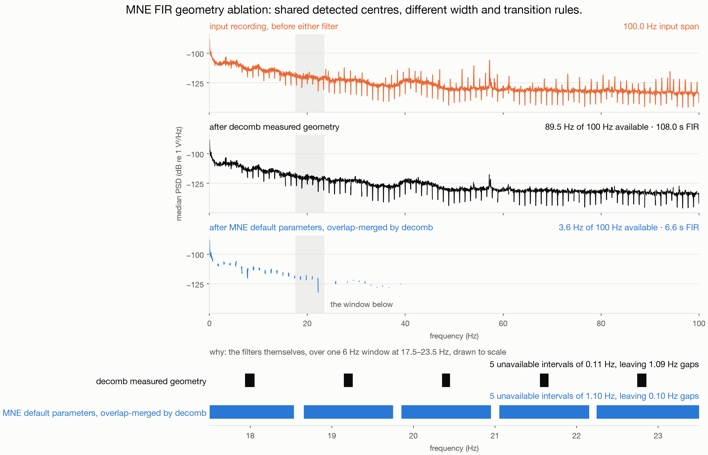

# decomb

<p align="center">
  
</p>

`decomb` detects and suppresses narrowband harmonic and isolated spectral artifacts in
continuous EEG. Each recording is fitted independently and written as a BrainVision
BIDS derivative with measured stopbands, transition bands, filter response, and
verification results.

## Problem statement

Residual periodic artifacts can remain in EEG acquired during or near fMRI after
gradient and pulse artifact correction [[1](#user-content-ref-1),
[2](#user-content-ref-2)]. Cryogenic pumps and scanner ventilation systems are reported
sources [[3](#user-content-ref-3), [4](#user-content-ref-4)]. Their frequencies can drift
within a recording and can occur as a harmonic series or as isolated narrowband lines.

The recording alone does not uniquely separate neural and artifactual contributions at
the same frequency. Source-separation methods require additional assumptions and cannot
establish unique recovery when those assumptions are unsupported
[[20](#user-content-ref-20)]. Filtering attenuates neural activity together with the
artifact and does not reconstruct the rejected signal [[6](#user-content-ref-6),
[21](#user-content-ref-21), [22](#user-content-ref-22)].

`decomb` therefore records every stopband and transition as unavailable for inference
and does not impute neural activity. Physical attribution requires independent evidence.
Source control remains preferable when the source is known
[[5](#user-content-ref-5)].

## Scope

Input recordings must use BrainVision format in an EEG-BIDS dataset
[[12](#user-content-ref-12), [14](#user-content-ref-14)]. Subject directories may contain
optional session and run entities. Channel metadata mismatches raise an error.

All channels typed as EEG are included in spectral estimation. Recordings must contain
finite values and at least one complete estimation window. Isolated-line detection
requires at least two non-overlapping windows. Scanner triggers and scanner clock
annotations are not used.

The method identifies narrow spectral structure. Broad rhythms and transient artifacts
require temporal or spatial methods [[7](#user-content-ref-7)]. A detected comb does not
identify its physical source.

## Installation

Python 3.11 or newer is required.

```bash
python3 -m venv .venv
source .venv/bin/activate
python3 -m pip install -e .
```

## Quick start

```bash
decomb diagnose --config decomb.yaml
decomb apply --config decomb.yaml
decomb verify --config decomb.yaml
decomb psd --config decomb.yaml
```

| Command | Operation |
| --- | --- |
| `diagnose` | Fits comb and isolated-line models and writes the proposed filter plan |
| `apply` | Fits each recording, filters EEG channels, and writes the complete derivative |
| `verify` | Reconstructs manifest stopbands and measures the files written to disk |
| `psd` | Writes matched source and derivative spectra and figures |

`apply` and `verify` require the complete discovered dataset. `diagnose` and `psd`
accept subject subsets. An existing output directory causes `apply` to stop.

## Configuration

The packaged configuration is
[`src/decomb/defaults.yaml`](src/decomb/defaults.yaml). Two settings define the
scientific correction.

| Setting | Default | Function |
| --- | --- | --- |
| `removal.estimation_window_s` | 54.0 s | Stationarity interval and spectral resolution |
| `removal.frequency_range_hz` | 0.0 to 100.0 Hz | Frequencies eligible for detection and filtering |

The default window gives Fourier bins separated by 0.018519 Hz and a Hann half-power
resolution of 0.026633 Hz [[8](#user-content-ref-8)]. Changing the duration changes the
frequency spacing, resolution, stopband width, transition width, and FIR duration.

`paths.bids_root` identifies the input dataset. Output and report locations have
packaged defaults. Optional `frequency_bands` entries report unavailable and retained
bandwidth and do not affect detection.

Unknown and obsolete settings raise an error. The upper analysis frequency cannot
exceed 100 Hz and is limited by the available spectrum and recording Nyquist frequency.

## Methods

### Spectral estimation

The configured duration is converted to the nearest whole number of samples. Windows
overlap by 50 percent, and the final window is aligned with the end of the recording. A
greedy non-overlapping subset supplies independent observations for model comparison.

Each EEG window is multiplied by a Hann window. A normalized one-sided periodogram is
summarized by the channel median. The whole-recording spectrum averages window power
within each channel before calculating the channel median. Power is represented in
decibels, and local maxima are refined by three-point parabolic interpolation. Hann
resolution follows Harris [[8](#user-content-ref-8)].

### Comb selection

Candidate fundamentals must place at least four harmonics in the analysis range. Power
on each harmonic grid is compared with power halfway between adjacent grid positions. A
zero-mean model is compared with a positive shared-mean model by Bayesian information
criterion, including a penalty for the number of candidates searched
[[9](#user-content-ref-9)]. Supported candidates are ranked by mean grid contrast
weighted by harmonic count.

Every integer multiple of the selected fundamental within the analysis range is
retained. Each harmonic is localized within one Hann half-power resolution of its
predicted position in the whole-recording spectrum and every overlapping window.

### Isolated-line selection

SciPy `find_peaks` finds local maxima outside the selected comb
[[16](#user-content-ref-16)]. Each candidate is assigned a half-power basin and localized
independently in every window.

Two Bayesian information criterion comparisons are required. The temporal comparison
tests whether power at the tracked peak is consistently greater than power two Hann
resolutions to either side in independent windows. The shape comparison tests a
positive Hann line response against a quadratic background in linear power. The shape
fit uses at least eight local frequency bins and accounts for each independently fitted
window position. Both comparisons must support the line.

### Stopbands and FIR filtering

Each stopband covers the lowest and highest positions observed in the whole recording
and overlapping windows, expanded by half a Fourier bin. Its minimum width is the Hann
half-power resolution. Stopbands are merged when their transitions would overlap.

The total transition bandwidth is 3.3 divided by the estimation-window duration in
seconds. MNE assigns half of this width to each stopband edge. All merged stopbands are
passed to MNE `Raw.notch_filter` in one call, and only EEG channels are modified
[[10](#user-content-ref-10), [11](#user-content-ref-11)].

| Parameter | Value |
| --- | --- |
| `freqs` | Measured stopband centres |
| `notch_widths` | Measured stopband widths |
| `trans_bandwidth` | Total width of 3.3 divided by the estimation-window duration |
| `method` | `fir` |
| `filter_length` | `auto` |
| `phase` | `zero` |
| `fir_window` | `hamming` |
| `fir_design` | `firwin` |
| `pad` | `reflect_limited` |
| `n_jobs` | `-1` |

This is a one-pass, zero-phase, noncausal FIR design with delay compensation. The
manifest records its exact sample count and measured response. A transition reaching
zero frequency or Nyquist raises an error [[6](#user-content-ref-6)].

### Attenuation and verification

Stopband power is summed across frequency bins for each EEG channel and averaged across
channels. Source and derivative spectra use complete, non-overlapping Hann blocks with
the configured duration. Samples outside the final complete block are excluded. The
reported change is the decibel ratio of derivative power to source power.

Each derivative recording is read from disk and checked against the expected values.
Independent verification confirms that scientific settings and recording metadata match
the apply stage, then recomputes stopband attenuation and adjacent available-line
contrast without fitting new targets.

Quality-control spectra use MNE `Raw.compute_psd` with Welch estimation
[[18](#user-content-ref-18)]. Source and derivative files use identical EEG channels,
samples, segment duration, 50 percent overlap, frequency range, and frequency grid. MNE
defaults provide a Hamming segment window, segment mean removal, mean aggregation, and
omission of spans marked by bad annotations. The channel median produces one spectrum
per recording.

## Outputs and provenance

The output follows EEG-BIDS and BIDS derivative conventions
[[12](#user-content-ref-12), [13](#user-content-ref-13),
[19](#user-content-ref-19)]. Corrected BrainVision triplets receive a `_desc-decomb`
entity. The derivative includes a stopband manifest, `dataset_description.json`, apply
and verification configurations, an independent verification table, and matched PSD
products. The manifest records targets, model evidence, interval geometry, FIR response,
attenuation, and unavailable bandwidth. Floating-point geometry is written with 17
significant digits.

## MNE FIR geometry ablation

This conditional ablation uses one 8.2-minute EEG recording. Both arms use MNE's FIR
implementation with the same decomb-detected centres, real samples, EEG channels, filter
design, and Welch grid. Only stopband width and transition rules differ. The decomb arm
uses measured trajectory envelopes and the transition rule described above. The
counterfactual arm starts from MNE's default parameters of centre frequency divided by
200 for notch width and 1 Hz total transition bandwidth, then decomb merges overlapping
transitions so that MNE can design one valid multiband FIR
[[10](#user-content-ref-10), [11](#user-content-ref-11)]. This is an MNE FIR geometry
ablation, not a decomb-versus-MNE method benchmark.

The literal unmerged MNE-default call is inapplicable to this dense target set: its
default transition intervals overlap and MNE raises a filter-design `ValueError`. The
reference shown here is therefore **MNE default parameters, overlap-merged by decomb**,
not a literal MNE-default method.

The measured decomb geometry makes 10.5 Hz unavailable and requires a 108.0 s FIR. The
overlap-merged MNE-default-parameter geometry makes 96.4 Hz unavailable with a 6.6 s
FIR, forms one continuous stopband above 40.2 Hz, and retains no frequency above 39.0
Hz. This is the frequency-selectivity versus temporal-extent trade-off. Retained
frequencies reproduce the input spectrum within 0.07 dB at the 95th percentile in both
arms.

The input recording is not raw, and its spectrum shows this. It already carries a comb of
narrowband nulls at harmonics of a 0.9 s period, spaced 1.11111 Hz with a median depth of
10.3 dB, which is characteristic of the periodic template subtraction used for gradient
artifact correction. Those nulls precede both filter arms. The comb corrected here is a
separate residual near 1.2 Hz: its stopbands sit a median 279 mHz from the nearest
pre-existing null, against a stopband half-width of 28 mHz. This section therefore
demonstrates correction of the residual periodic artifact, not of the gradient artifact.

Unavailable bandwidth is decomb's conservative inference policy: it counts every full
stopband and transition. It is not a measurement of neural information destroyed by
MNE. Each spectrum panel is drawn only where its arm declares the band available, so the
gaps show this policy rather than measured attenuation. The lowest panel draws both
filter geometries to scale over one 6 Hz window.



The participant audit comprised 90 recordings from 15 participants and 12.1 hours of
EEG. Verification reconstructed 8,120 stopbands and measured a median stopband power
change of -28.64 dB.

## Software and testing

Version `0.1.0` requires Python 3.11, NumPy 1.24
[[15](#user-content-ref-15)], SciPy 1.11 [[16](#user-content-ref-16)], MNE-Python 1.6
[[10](#user-content-ref-10), [11](#user-content-ref-11)], MNE-BIDS 0.14
[[14](#user-content-ref-14)], pandas 2.0, PyYAML 6.0, Matplotlib 3.8
[[17](#user-content-ref-17)], joblib 1.3, and pybv 0.7.5. Package roles and constraints are
declared in [`pyproject.toml`](pyproject.toml).

```bash
.venv/bin/pytest -q
.venv/bin/ruff check src tests
```

## References

1. <a name="ref-1"></a>Allen PJ, Josephs O, Turner R. A method for removing imaging artifact from continuous
   EEG recorded during functional MRI. *NeuroImage*. 2000, 12, 230 to 239.
   [DOI](https://doi.org/10.1006/nimg.2000.0599)
2. <a name="ref-2"></a>Niazy RK, Beckmann CF, Iannetti GD, Brady JM, Smith SM. Removal of FMRI environment
   artifacts from EEG data using optimal basis sets. *NeuroImage*. 2005, 28, 720 to 737.
   [DOI](https://doi.org/10.1016/j.neuroimage.2005.06.067)
3. <a name="ref-3"></a>Rothlübbers S, Relvas V, Leal A, Murta T, Lemieux L, Figueiredo P. Characterisation
   and reduction of the EEG artefact caused by the helium cooling pump in the MR
   environment. *Brain Topography*. 2015, 28, 208 to 220.
   [DOI](https://doi.org/10.1007/s10548-014-0408-0)
4. <a name="ref-4"></a>Nierhaus T, Gundlach C, Goltz D, et al. Internal ventilation system of MR scanners
   induces specific EEG artifact during simultaneous EEG-fMRI. *NeuroImage*. 2013, 74,
   70 to 76. [DOI](https://doi.org/10.1016/j.neuroimage.2013.02.016)
5. <a name="ref-5"></a>Mullinger KJ, Castellone P, Bowtell R. Best current practice for obtaining high quality
   EEG data during simultaneous fMRI. *Journal of Visualized Experiments*. 2013, 76,
   e50283. [DOI](https://doi.org/10.3791/50283)
6. <a name="ref-6"></a>Widmann A, Schröger E, Maess B. Digital filter design for electrophysiological data,
   a practical approach. *Journal of Neuroscience Methods*. 2015, 250, 34 to 46.
   [DOI](https://doi.org/10.1016/j.jneumeth.2014.08.002)
7. <a name="ref-7"></a>Bullock M, Jackson GD, Abbott DF. Artifact reduction in simultaneous EEG-fMRI, a
   systematic review of methods and contemporary usage. *Frontiers in Neurology*. 2021,
   12, 622719. [DOI](https://doi.org/10.3389/fneur.2021.622719)
8. <a name="ref-8"></a>Harris FJ. On the use of windows for harmonic analysis with the discrete Fourier
   transform. *Proceedings of the IEEE*. 1978, 66, 51 to 83.
   [DOI](https://doi.org/10.1109/PROC.1978.10837)
9. <a name="ref-9"></a>Schwarz G. Estimating the dimension of a model. *Annals of Statistics*. 1978, 6,
   461 to 464. [DOI](https://doi.org/10.1214/aos/1176344136)
10. <a name="ref-10"></a>Gramfort A, Luessi M, Larson E, et al. MNE software for processing MEG and EEG data.
    *NeuroImage*. 2014, 86, 446 to 460.
    [DOI](https://doi.org/10.1016/j.neuroimage.2013.10.027)
11. <a name="ref-11"></a>Gramfort A, Luessi M, Larson E, et al. MEG and EEG data analysis with MNE-Python.
    *Frontiers in Neuroscience*. 2013, 7, 267.
    [DOI](https://doi.org/10.3389/fnins.2013.00267)
12. <a name="ref-12"></a>Pernet CR, Appelhoff S, Gorgolewski KJ, et al. EEG-BIDS, an extension to the Brain
    Imaging Data Structure for electroencephalography. *Scientific Data*. 2019, 6, 103.
    [DOI](https://doi.org/10.1038/s41597-019-0104-8)
13. <a name="ref-13"></a>Gorgolewski KJ, Auer T, Calhoun VD, et al. The Brain Imaging Data Structure, a format
    for organizing and describing outputs of neuroimaging experiments. *Scientific
    Data*. 2016, 3, 160044. [DOI](https://doi.org/10.1038/sdata.2016.44)
14. <a name="ref-14"></a>Appelhoff S, Sanderson M, Brooks TL, et al. MNE-BIDS, organizing
    electrophysiological data into the BIDS format and facilitating their analysis.
    *Journal of Open Source Software*. 2019, 4, 1896.
    [DOI](https://doi.org/10.21105/joss.01896)
15. <a name="ref-15"></a>Harris CR, Millman KJ, van der Walt SJ, et al. Array programming with NumPy. *Nature*.
    2020, 585, 357 to 362. [DOI](https://doi.org/10.1038/s41586-020-2649-2)
16. <a name="ref-16"></a>Virtanen P, Gommers R, Oliphant TE, et al. SciPy 1.0, fundamental algorithms for
    scientific computing in Python. *Nature Methods*. 2020, 17, 261 to 272.
    [DOI](https://doi.org/10.1038/s41592-019-0686-2)
17. <a name="ref-17"></a>Hunter JD. Matplotlib, a 2D graphics environment. *Computing in Science and
    Engineering*. 2007, 9, 90 to 95.
    [DOI](https://doi.org/10.1109/MCSE.2007.55)
18. <a name="ref-18"></a>Welch P. The use of fast Fourier transform for the estimation of power spectra, a
    method based on time averaging over short, modified periodograms. *IEEE Transactions
    on Audio and Electroacoustics*. 1967, 15, 70 to 73.
    [DOI](https://doi.org/10.1109/TAU.1967.1161901)
19. <a name="ref-19"></a>BIDS Contributors. BIDS Derivatives. *Brain Imaging Data Structure specification*.
    Version 1.11.1.
    [Specification](https://bids-specification.readthedocs.io/en/stable/derivatives/introduction.html)
20. <a name="ref-20"></a>Hyvärinen A, Oja E. Independent component analysis, algorithms and applications.
    *Neural Networks*. 2000, 13, 411 to 430.
    [DOI](https://doi.org/10.1016/S0893-6080(00)00026-5)
21. <a name="ref-21"></a>de Cheveigné A, Nelken I. Filters, when, why, and how not to use them. *Neuron*.
    2019, 102, 280 to 293.
    [DOI](https://doi.org/10.1016/j.neuron.2019.02.039)
22. <a name="ref-22"></a>Leske S, Dalal SS. Reducing power line noise in EEG and MEG data via spectrum
    interpolation. *NeuroImage*. 2019, 189, 763 to 776.
    [DOI](https://doi.org/10.1016/j.neuroimage.2019.01.026)

MNE implementation details are documented in the
[notch-filter API](https://mne.tools/stable/generated/mne.filter.notch_filter.html), the
[filtering methods tutorial](https://mne.tools/stable/auto_tutorials/preprocessing/25_background_filtering.html),
and the
[Welch PSD API](https://mne.tools/stable/generated/mne.io.Raw.html#mne.io.Raw.compute_psd).

## License

BSD 3-Clause. See [`LICENSE`](LICENSE).
