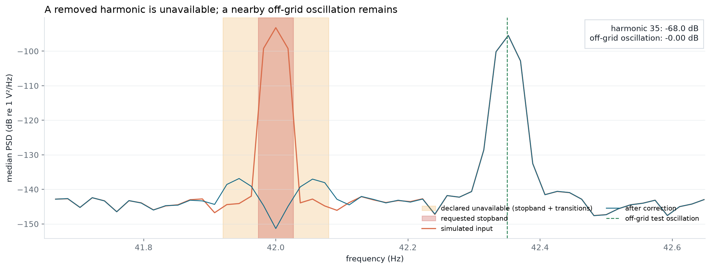

# decomb

<p align="center">
  
</p>

`decomb` detects a participant-specific EEG artifact comb and removes only its supported
harmonics with narrow zero-phase FIR notches. It writes a complete BrainVision BIDS
derivative and an explicit list of frequencies that must not be used for inference.

The central scientific limitation is deliberate: neural activity and artifact occupying
the same frequency in one recording are not identifiable from that recording alone. The
pipeline therefore does not claim to recover neural signal inside a harmonic. It removes
the contaminated interval and declares the stopband plus both transitions unavailable.

## Abstract

`decomb` is research software for characterising and selectively suppressing narrow
harmonic-comb contamination in continuous EEG stored as BIDS-compatible BrainVision data
[[10](#references), [13](#references)].
Its primary use case is EEG acquired during or near fMRI after established gradient- and
pulse-artifact correction [[1](#references), [2](#references)]. Residual MR-environment
sources can include cryogenic-pump and ventilation artifacts with repeated spectral peaks
[[3](#references), [4](#references)]. A regular comb is evidence of spectral structure,
not proof of physical source or stationarity; source control remains preferable whenever
possible [[5](#references)].

The software contribution is an auditable, per-recording procedure: blind diagnosis,
uncertainty-aware harmonic localization, finite-width FIR notch construction, BIDS
provenance, disk read-back, and independent spectral verification. It does not replace
gradient or ballistocardiographic correction and makes no general performance claim across
scanners, sites, or populations. Filter effects must be reported and interpreted in the
context of the downstream analysis [[6](#references), [7](#references)].

## Workflow

```bash
decomb diagnose --config decomb.yaml
decomb apply --config decomb.yaml
decomb verify --config decomb.yaml
decomb psd --config decomb.yaml
```

- `diagnose` performs a blind cohort line sweep and estimates the comb structure.
- `apply` independently fits every recording, plans its narrow harmonic stopbands, and
  atomically writes the BIDS derivative.
- `verify` reconstructs the immutable plan from the derivative manifest and re-measures
  the data written to disk. It reports measurements, not an arbitrary acceptance rule.
- `psd` produces source-versus-derivative spectral figures.

There is no benchmark gate, neural-preservation reconstruction, manual wide-notch stage,
or fallback cleaning method. Invalid assumptions and unidentifiable combs raise errors.

## Installation

```bash
python -m venv .venv
source .venv/bin/activate
pip install -e .
```

Python 3.11 or newer is required.

## Configuration

Copy `src/decomb/defaults.yaml` to `decomb.yaml` and change the site-specific paths and
comb geometry. The default 54-second Hann estimation window was retained after the tested
alternatives performed worse. At that duration its half-power spectral resolution is
0.026633 Hz.

```yaml
paths:
  bids_root: /data/study/bids
  output_root: /data/study/bids_decombed
  diagnosis_dir: outputs/diagnosis
  removal_dir: outputs/removal

dataset:
  task: "*"
  tr_seconds: null

removal:
  estimation_window_s: 54.0
  estimation_overlap: 0.5
  filter_jobs: 4
  nominal_fundamental_hz: 1.2
  harmonic_range: [24, 79]
  removal_harmonic_range: [22, 82]
  low_hz: 3.0
  high_hz: 99.8
  minimum_stopband_resolutions: 2.0
  transition_bandwidth_resolutions: 4.0
```

`dataset.tr_seconds` adds scanner-grid alignment to diagnosis. It does not alter the
notches: trigger-based correction did not improve the tested recordings, so it is not
part of the transform.

Every tunable scientific value is read from YAML; the Python implementation contains no
task, paradigm, scanner, or participant special cases. `dataset.task` may be any BIDS task
label or `"*"`, and `frequency_bands` may contain any study-defined band names. Unknown or
missing correction keys are errors. Stopband and transition widths in hertz are derived
from the configured resolution multipliers and the estimation-window duration.

## Method

Let $x[n]$ be one channel of a window, $f_s$ the sampling frequency, $N$ the sample
count, $T=N/f_s$, and $\Delta f=1/T$. With Hann taper $w[n]$, the one-sided density is

$$
S(f_k)=\frac{c_k}{f_s\sum_n w^2[n]}
\left|\sum_{n=0}^{N-1}w[n]x[n]e^{-2\pi i kn/N}\right|^2,
\qquad f_k=\frac{k f_s}{N},
$$

where $c_k=2$ except at DC and Nyquist. Channels are summarized by their median and
windows by their mean. In decibels, $X(f)=10\log_{10}S(f)$. Local prominence is measured
against a symmetric running-median background that excludes the line core:

$$
B(f_k)=\operatorname{median}\{X(f_j):c<|j-k|\le H\},
\qquad P(f_k)=X(f_k)-B(f_k).
$$

The catalogue controls its dependent frequency-bin family with the conservative
Benjamini--Yekutieli procedure [[14](#references)]. Peak positions are refined below the
FFT grid by a three-point parabola. The Hann half-power resolution used by the planner is
$r=1.4382/T$ [[8](#references)].

For refined harmonic positions $\hat f^{(k)}$ and prominence weights $w_k$, the comb
fundamental is the weighted least-squares slope through the origin:

$$
\hat f_0=\frac{\sum_{k\in\mathcal K}w_k k\hat f^{(k)}}
{\sum_{k\in\mathcal K}w_k k^2}.
$$

Membership $\mathcal K$ is iterated to a fixed point under the configured residual bound.
The fit is accepted only with at least `min_harmonics_for_fit` members and bounded scatter,

$$
\operatorname{RMS}=\sqrt{\frac{1}{|\mathcal K|}
\sum_{k\in\mathcal K}\left(\hat f^{(k)}-k\hat f_0\right)^2}.
$$

Fundamental uncertainty is the delete-one jackknife [[9](#references)]:

$$
\widehat{\operatorname{SE}}(\hat f_0)=
\sqrt{\frac{n-1}{n}\sum_{i=1}^{n}
\left(\hat f_0^{(-i)}-\bar f\right)^2},
\qquad
\bar f=\frac1n\sum_{i=1}^{n}\hat f_0^{(-i)}.
$$

For each continuous recording:

1. The channel-median whole-recording spectrum authorizes the comb fundamental and the
   mutually consistent harmonics eligible for removal.
2. Overlapping Hann-window spectra localize only those already-authorized harmonics. A
   window obscured by a transient contributes no position; it cannot create a target and
   missing evidence is never copied from another window.
3. Each stopband spans the whole-recording position and every directly observed window
   position, plus whole-recording fundamental uncertainty,
   `z × harmonic × SE(f0)`.
4. A stationary harmonic receives the configured minimum stopband width in spectral
   resolutions.
5. Stopbands without enough passband for separate transitions are merged.
6. MNE-Python applies all stopbands in one zero-phase FIR operation to EEG channels only.

More precisely, let $p_{k0}$ be harmonic $k$'s whole-recording position,
$\sigma_0$ the whole-recording fundamental standard error, $J_k$ the windows in which
that authorized harmonic is directly localized, and $p_{kj}$ its position in window $j$.
With $z$ equal to `uncertainty_confidence_z`, the measured uncertainty envelope is

$$
a_k=\min\left(p_{k0}-zk\sigma_0,\min_{j\in J_k}p_{kj}\right),\qquad
b_k=\max\left(p_{k0}+zk\sigma_0,\max_{j\in J_k}p_{kj}\right).
$$

When $J_k$ is empty, only the whole-recording bounds enter the envelope. This preserves
the explicit absence of window evidence while allowing the global FIR plan to remain
robust to a broadband transient that masks one window.

Let $s$ be `minimum_stopband_resolutions` and $t$ be
`transition_bandwidth_resolutions`. With $m_k=(a_k+b_k)/2$ and
$h_k=\max((b_k-a_k)/2,sr/2)$, the requested stopband is

$$
[L_k,U_k]=[m_k-h_k,\;m_k+h_k].
$$

Thus every stationary stopband is at least $sr$ wide, while measured motion and propagated
uncertainty can only widen it. The total MNE transition bandwidth is $q=tr$, making the
declared inference exclusion

$$
E_k=[L_k-q/2,\;U_k+q/2].
$$

Intervals too close to sustain separate transitions are merged before filtering. For an
analysis band $A=[A_0,A_1]$, the unavailable share reported in the manifest is

$$
C_A=\frac{\left|A\cap\bigcup_k E_k\right|}{A_1-A_0},
\qquad R_A=1-C_A.
$$

Measured attenuation inside a requested stopband is

$$
\Delta_k=10\log_{10}\left(\frac{P_{\mathrm{after},k}}
{P_{\mathrm{before},k}}\right)\ \mathrm{dB}.
$$

With the packaged defaults, the stopband floor is two resolutions and the total transition
bandwidth is four resolutions. MNE allocates half of the transition bandwidth on each
side. This keeps the requested stopband narrow while avoiding an unrealistically sharp
response and excessive ringing [[6](#references)]. The implementation follows the
[MNE notch filter API](https://mne.tools/stable/generated/mne.filter.notch_filter.html)
and [MNE filtering tutorial](https://mne.tools/stable/auto_tutorials/preprocessing/25_background_filtering.html)
[[11](#references), [12](#references)].

The method does not automatically notch isolated peaks or every integer multiple of the
fundamental. A configured harmonic range only defines eligibility; it does not manufacture
evidence for an absent line.

## Reproducible simulated demonstration

The following figures are generated by the current production estimator and FIR transform,
not drawn by hand. The deterministic simulation contains coloured background noise, a
27-member 1.2 Hz comb, and a known oscillation at 42.35 Hz that does not lie on the comb.
Every signal and correction value is declared in
[`docs/simulated_readme.yaml`](docs/simulated_readme.yaml), and
[`docs/make_figure.py`](docs/make_figure.py) regenerates both images.


All 27 simulated harmonics were independently supported and planned. The overview shows
deep attenuation confined to their narrow neighborhoods while the off-grid test oscillation
remained at −0.00 dB amplitude change. This is an implementation test on known signals, not
a performance estimate for biological EEG.



The detail view makes the inference boundary explicit. Harmonic 35 at 42 Hz was attenuated
by 68.0 dB in amplitude, but its shaded stopband and FIR transitions are unavailable for
scientific inference—the plot does not claim neural recovery there. The nearby 42.35 Hz test
oscillation is outside that interval and was preserved. Regenerate the figures with:

```bash
python docs/make_figure.py
```

## Outputs

`apply` mirrors BIDS sidecars, rewrites only `.eeg` binaries, and adds:

- `harmonic_notch_manifest.tsv` in the derivative and report directory;
- `effective_config_apply.txt`, listing every YAML and derived value with provenance;
- a derivative `dataset_description.json` containing the complete correction settings,
  derived FIR geometry, and inference limit.

Each manifest row records:

- recording and contributing harmonic number(s);
- total estimation-window count and the number directly supporting the stopband;
- nominal stopband edges;
- transition-inclusive unavailable edges;
- transition bandwidth;
- fitted fundamental;
- measured in-stopband attenuation after filtering;
- float32 BrainVision round-trip deviation;
- unavailable and retained shares of every analysis band defined in YAML.

`verify` writes `harmonic_notch_verification.tsv` with disk-measured attenuation and the
largest adjacent prominence in the original and cleaned recordings, together with its
change. Adjacent peaks are reported rather than silently expanded into new notches because
a nearby peak is not evidence that it belongs to the comb.

## Interpreting corrected data

The cleaned derivative is suitable for analyses outside the declared unavailable
intervals. Analyses at a notched harmonic are not scientifically recoverable from a single
recording and must exclude that frequency interval. Narrow notches preserve more of the
surrounding band than conventional 1-Hz notches, but they do not make the exact harmonic
interpretable.

On a three-participant real-recording validation, the current method planned 51–57
supported stopbands per recording. Nominal stopband width totaled 3.34–3.73 Hz and the
transition-inclusive unavailable width totaled 8.78–9.80 Hz. Per-recording median
in-stopband attenuation was −33.2 to −35.5 dB after disk round-trip; independent
verification measured a −34.5 dB cohort median. The unavailable share was 2.16–3.80% of
beta and 12.65–13.50% of gamma. The strongest adjacent off-grid line, at 46.963 Hz, remained
and was reported rather than notched because it was not an exact supported comb harmonic.
These are measurements of three recordings at one site, not promised performance bounds.

## Tests

```bash
pytest -q
ruff check src tests docs/make_figure.py
```

The focused automatic-notch tests cover whole-recording authorization, explicit missing
window evidence, uncertainty and measured motion, transition merging, MNE filtering,
off-band tone preservation, manifest geometry, BIDS round-trip behavior, CLI routing,
verification complexity, and the README simulation.

## References

1. Allen PJ, Josephs O, Turner R. A method for removing imaging artifact from continuous
   EEG recorded during functional MRI. *NeuroImage*. 2000;12:230–239.
   [doi:10.1006/nimg.2000.0599](https://doi.org/10.1006/nimg.2000.0599)
2. Niazy RK, Beckmann CF, Iannetti GD, Brady JM, Smith SM. Removal of FMRI environment
   artifacts from EEG data using optimal basis sets. *NeuroImage*. 2005;28:720–737.
   [doi:10.1016/j.neuroimage.2005.06.067](https://doi.org/10.1016/j.neuroimage.2005.06.067)
3. Rothlübbers S, Relvas V, Leal A, Murta T, Lemieux L, Figueiredo P. Characterisation and
   reduction of the EEG artefact caused by the helium cooling pump in the MR environment.
   *Brain Topography*. 2015;28:208–220.
   [doi:10.1007/s10548-014-0408-0](https://doi.org/10.1007/s10548-014-0408-0)
4. Nierhaus T, Gundlach C, Goltz D, et al. Internal ventilation system of MR scanners
   induces specific EEG artifact during simultaneous EEG-fMRI. *NeuroImage*.
   2013;74:70–76.
   [doi:10.1016/j.neuroimage.2013.02.016](https://doi.org/10.1016/j.neuroimage.2013.02.016)
5. Mullinger KJ, Castellone P, Bowtell R. Best current practice for obtaining high quality
   EEG data during simultaneous fMRI. *Journal of Visualized Experiments*. 2013;76:e50283.
   [doi:10.3791/50283](https://doi.org/10.3791/50283)
6. Widmann A, Schröger E, Maess B. Digital filter design for electrophysiological data—a
   practical approach. *Journal of Neuroscience Methods*. 2015;250:34–46.
   [doi:10.1016/j.jneumeth.2014.08.002](https://doi.org/10.1016/j.jneumeth.2014.08.002)
7. Bullock M, Jackson GD, Abbott DF. Artifact reduction in simultaneous EEG-fMRI: a
   systematic review of methods and contemporary usage. *Frontiers in Neurology*.
   2021;12:622719.
   [doi:10.3389/fneur.2021.622719](https://doi.org/10.3389/fneur.2021.622719)
8. Harris FJ. On the use of windows for harmonic analysis with the discrete Fourier
   transform. *Proceedings of the IEEE*. 1978;66:51–83.
   [doi:10.1109/PROC.1978.10837](https://doi.org/10.1109/PROC.1978.10837)
9. Efron B, Stein C. The jackknife estimate of variance. *Annals of Statistics*.
   1981;9:586–596.
   [doi:10.1214/aos/1176345462](https://doi.org/10.1214/aos/1176345462)
10. Pernet CR, Appelhoff S, Gorgolewski KJ, et al. EEG-BIDS, an extension to the Brain
    Imaging Data Structure for electroencephalography. *Scientific Data*. 2019;6:103.
    [doi:10.1038/s41597-019-0104-8](https://doi.org/10.1038/s41597-019-0104-8)
11. Gramfort A, Luessi M, Larson E, et al. MNE software for processing MEG and EEG data.
    *NeuroImage*. 2014;86:446–460.
    [doi:10.1016/j.neuroimage.2013.10.027](https://doi.org/10.1016/j.neuroimage.2013.10.027)
12. Gramfort A, Luessi M, Larson E, et al. MEG and EEG data analysis with MNE-Python.
    *Frontiers in Neuroscience*. 2013;7:267.
    [doi:10.3389/fnins.2013.00267](https://doi.org/10.3389/fnins.2013.00267)
13. Gorgolewski KJ, Auer T, Calhoun VD, et al. The Brain Imaging Data Structure, a format
    for organizing and describing outputs of neuroimaging experiments. *Scientific Data*.
    2016;3:160044.
    [doi:10.1038/sdata.2016.44](https://doi.org/10.1038/sdata.2016.44)
14. Benjamini Y, Yekutieli D. The control of the false discovery rate in multiple testing
    under dependency. *Annals of Statistics*. 2001;29:1165–1188.
    [doi:10.1214/aos/1013699998](https://doi.org/10.1214/aos/1013699998)

## License

BSD 3-Clause. See [LICENSE](LICENSE).
