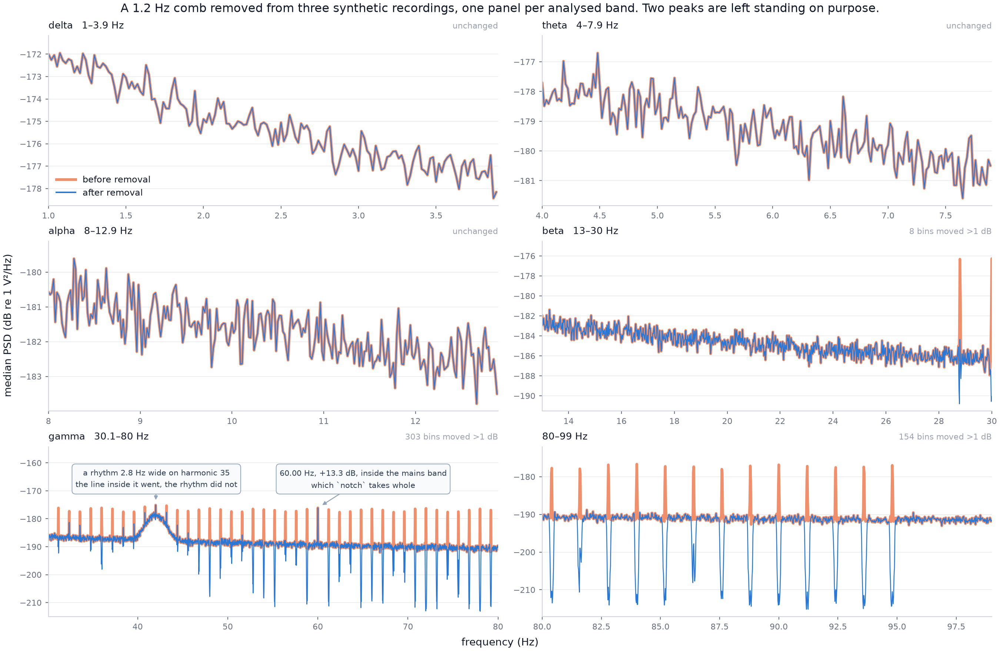

# decomb

Removal of narrowband line and comb artifacts from continuous EEG, written for recordings
made during concurrent fMRI.

`decomb` measures each line's frequency in each recording and subtracts a sinusoid at that
frequency. Before writing, it runs the same removal over injected test signals and stops if
the result falls outside criteria declared in the config.

## What gradient and pulse correction leave behind

EEG recorded inside a scanner is corrected in two large steps, and a third class of
artifact is left behind by both.

**Gradient artifact.** Switching gradients induce millivolt-scale EMF in the electrode
leads. It is removed by average artifact subtraction: average over the repeating slice or
volume epoch, subtract the template. This works precisely because the artifact is *locked
to the acquisition* — it repeats at `k/TR` and at the slice rate, so it survives the
average while everything else cancels.

**Pulse artifact.** Cardiac-driven motion of the head and leads in the static field
produces a ballistocardiogram of tens of microvolts, removed by a template locked to the
R peak, an optimal basis set, or ICA.

**What both leave behind.** Any source that is periodic but *not* locked to the imaging
sequence or the heartbeat is untouched by either step. It averages toward zero in every
template and stays in the data at full amplitude. An MR suite is full of such sources, and
the physics that makes EEG-fMRI hard is what makes them visible: a
conductor moving in a strong static field induces a voltage proportional to `B₀` and to the
rate of change of the loop area. Millimetre vibrations that would be invisible outside the
bore become measurable EEG.

The usual sources are mechanical and run continuously:

- **The cold head and helium compressor.** The cryocooler that reliquefies helium vibrates
  the magnet and the bore. On many systems it can be switched off for the duration of an
  acquisition — the cleanest fix, and worth trying first.
- **The bore ventilation fan.** A constant-speed fan puts energy at its rotation rate and
  at the blade-pass frequency. Also often switchable.
- **Room plant.** Chillers, pumps, and HVAC, coupled through the floor and the gantry.
- **Mains, and anything driven by it.** Machinery on synchronous motors is phase-locked to
  the supply, so its repetition rate is a rational fraction of 50 or 60 Hz and stays
  coherent from one session to the next.
- **Stimulus and response hardware.** Projectors, eye trackers, button boxes, and their
  cabling.

Each of these is periodic and none of them is a pure tone. A piston, a blade passing a
strut, a rectified supply: any periodic non-sinusoidal drive puts energy at *every*
harmonic of its repetition rate. What reaches the EEG is therefore not one line but a
**comb** — dozens of narrow lines at integer multiples of a single fundamental, each a few
millihertz wide, each phase-stable over minutes.

This matters most where EEG-fMRI analyses are most fragile. A comb at a low fundamental
puts its harmonics across beta and gamma, where a scanner-EEG study has the least signal to
spare; a phase-stable line shared across electrodes inflates coherence between every pair
carrying it, so it reads as global connectivity at that frequency; and because its power is
concentrated into a few millihertz rather than spread over the band, a line that is small
in microvolts can still be most of that band's power. `decomb diagnose` measures that share
per band and per participant, so the decision can be made on a number.

Given `dataset.tr_seconds`, every detected line is also placed on the `k/TR` grid of the
acquisition. A line **on** that grid is residual gradient artifact, and points back to the
gradient correction rather than to this tool. A line **off** it comes from the room, and no
template locked to the acquisition will reach it. The rest of the workflow assumes that
distinction has been made.

## Why not a notch filter

Fifty FIR notches take the surrounding band with them; one wide notch takes far more
spectrum than the lines occupy. Either way the cost falls on the band the filter was meant
to clean.

The lines are monochromatic and their frequencies are measurable, so they can instead be
projected out at those measured frequencies, which costs a few hundredths of a hertz per
line rather than a band.



Three 300 s synthetic recordings: pink background, a 1.2 Hz comb over harmonics 24-79
standing 12 dB above it, and a rhythm planted on one of those harmonics. Produced by
[`docs/make_figure.py`](docs/make_figure.py), which builds the data, runs `diagnose`,
`benchmark` and `apply` through their ordinary entry points, and prints every number below
as it measures it.

Delta, theta and alpha are untouched: not one bin moves by 1 dB. Across the removed span
the 55 targeted harmonics fall from 12.3 dB above background to 1.1 dB, and outside the
lines the spectrum moves by at most 0.06 dB.

Two features survive, neither of them removed:

- **42 Hz** carries a 2.8 Hz-wide rhythm sitting exactly on comb harmonic 35. The harmonic
  inside it is removed and the rhythm is not, because a rhythm is whole hertz wide and a
  line is a tenth of one. Linewidth keeps the oscillation out of the removal's reach, not
  any prominence threshold.
- **60 Hz** is comb harmonic 50, inside the `mains_notch_hz` band that `exclude_mains`
  hands to `notch`. Two stages must not aim at the same spectrum.

## Design choices

**The benchmark gate.** `apply` will not run unless `benchmark` passed on the same data
under the same settings, and the criteria are declared in the config before the measurement
is taken.

**Band cost.** A broadband probe goes through the identical transform, so the reported cost
is what a signal occupying the band loses rather than what the plan predicted. It is
recorded in the output's `GeneratedBy` provenance.

**Blind verification.** `verify` re-sweeps the cleaned data under FDR control without
knowledge of where the targets were, so it can find a line the removal never aimed at.

**No events.** Any continuous recording is a valid input; no task, trigger channel or epoch
structure is needed.

## Install

```bash
pip install -e .
```

Python 3.11+. Depends on MNE, MNE-BIDS, pybv, NumPy, SciPy, pandas, matplotlib, joblib and
PyYAML; `pip install -e ".[dev]"` adds pytest and ruff. `decomb --help` lists the stages and
options.

## Quickstart

Point `decomb` at a BIDS root and ask what is in it. Nothing is written until `apply`.

```bash
decomb diagnose --bids-root data/bids --output-dir outputs/diagnosis
```

```
Measuring 3 recording(s) under data/bids
58 line(s) over 3 subject(s): 53 comb, 0 isolated
  fundamental 1.200000 Hz over harmonics 24-79, residual RMS 0.4 mHz
  set removal.nominal_fundamental_hz to this value and removal.harmonic_range to the span above.

share of each band that is line artifact (median over subjects):
  delta          0.00%  (worst subject 0.00%, 0 line(s) inside)
  theta          0.00%  (worst subject 0.00%, 0 line(s) inside)
  alpha          0.00%  (worst subject 0.00%, 0 line(s) inside)
  beta           1.78%  (worst subject 1.88%, 2 line(s) inside)
  gamma         21.00%  (worst subject 21.62%, 38 line(s) inside)
```

The fundamental and the harmonic span go into the config, since every later stage measures
against the grid they define. The band shares say whether to bother at all: a fifth of gamma
is line artifact here, and delta through alpha carry none of it.

Copy the packaged [`defaults.yaml`](src/decomb/defaults.yaml) to `decomb.yaml`, set what
`diagnose` just reported, then run the rest against that one file:

```bash
decomb benchmark --config decomb.yaml
```

```
passed 3/3 runs
  gate_transient_preserved         3/3
  gate_transient_undistorted       3/3
  seam (cohort criterion)          PASS: 0 exceeded (count p=1.0000, maximum p=0.8780), worst ratio 0.17
  residual (cohort criterion)      PASS: 0 of 3 recordings (smallest p=0.122)
  focal residual (cohort)          PASS: 0 of 3 recordings (smallest p=0.512)
  preservation (measurement)       probes 1.5e-05 dB against a control's 0.00057; off-target band 0.019 dB against 0.014
  band cost (measurement)          median 0.138, worst 0.141 of 28-95 Hz lost by a broadband probe
  in-band probe survival           median 0.002, worst 0.000 (measurement, not a criterion)
```

With that passed, the write:

```bash
decomb apply --config decomb.yaml
decomb verify --config decomb.yaml
decomb report --config decomb.yaml
```

```
median suppression 10.1 dB; worst residual line 12.31 dB
  declared data/bids_decombed/dataset_description.json a derivative of data/bids
```

`apply` matches the settings fingerprint that `benchmark` recorded, so loosening a criterion
and re-running does not inherit the old pass.

The output above came from three 300 s synthetic recordings with a known 1.2 Hz comb, with
the paths shortened. [`docs/make_figure.py`](docs/make_figure.py) builds that dataset and
runs the same stages, so you can reproduce it without data of your own:

```bash
python docs/make_figure.py --keep /tmp/decomb-demo
```

## The stages

```bash
decomb diagnose     # what lines are there, do they share a fundamental, and do they matter?
decomb benchmark    # does the removal preserve signal? run this before apply
decomb apply        # write the cleaned BIDS copy
decomb verify       # re-measure what was written
decomb report       # band-by-band outcome tables
decomb notch        # optional: wide notch over cluster bands
decomb psd          # before-and-after spectra
```

Every stage takes the same options, so a run is described by one config and the few
overrides you gave it:

- `--config PATH` — defaults to `./decomb.yaml`, then the packaged defaults. `DECOMB_CONFIG`
  does the same.
- `--bids-root PATH` — the source root, without editing the config.
- `--output-root PATH` — where `apply` puts the cleaned copy.
- `--output-dir PATH`, `--report-dir PATH` — where the catalogue and the tables go.
- `--filter-length`, `--mt-bandwidth` — override the removal geometry for one run.

`--subjects sub-01 sub-02` restricts `diagnose` and `psd` to a subset, and is refused by
`benchmark`, `apply`, `verify` and `notch` on purpose: their criteria are decided over the
recordings jointly, so a subset could neither certify a dataset nor leave the output root in
a state the provenance describes.

`diagnose` also counts detections per band, which is how you tell a band `apply` can clear
from one only `notch` can.

## What each stage writes

The tables are TSV, so the numbers a stage decided on can be read without `decomb`.
Locations come from `paths`; `diagnosis_dir` and `removal_dir` default to
`outputs/diagnosis` and `outputs/removal`.

`diagnose` writes the catalogue. `lines.tsv` has a row per detection — refined frequency,
prominence and its bootstrap interval, half-power width, the q-value that admitted it, the
number of subjects carrying it, its comb harmonic, and its position on the `k/TR` grid.
`comb.tsv` has the fitted fundamental and spacing, the supporting harmonics and the scatter
about the grid. `lines_per_band.tsv` and `band_impact.tsv` hold the per-band counts and
artifact shares printed at the end of the run, and `spectra.npz` the spectra the sweep saw.

`benchmark` writes `benchmark.tsv`, a row per recording carrying every criterion, the
control it was measured against, its p-value and the settings fingerprint.

`apply` writes the cleaned copy to `output_root` with the `.eeg` binaries rewritten and
every sidecar byte-identical, and records in its `dataset_description.json` the version,
the fingerprint, the full parameter set and the measured band cost. Alongside it,
`removal_manifest.tsv` gives the fundamental used, the target counts, the suppression and
residual statistics, the read-back check and the digests tying the write to its benchmark.
The whole derivative is staged in a hidden directory and moved into place only once every
recording has been written and read back within `removal.roundtrip_relative_tolerance`, so
an interrupted run cannot leave a half-cleaned dataset. The manifest goes to `removal_dir`
and to the output root, so the copy carries its own record of what was done to it.

`verify` writes `verification.tsv`, the blind re-sweep set beside the same sweep of the
original, with `verification_spectra.npz` beside it. `report` writes `band_outcomes.tsv`
(artifact share per band, before and after), `per_subject_line_residual.tsv` (what survived
at each target, per subject) and `removal_before_after.png`. `psd` writes overall, tiled and
per-recording spectra, and `notch` writes `notch_manifest.tsv`.

## Configuration

One file, and it holds everything. Copy the packaged
[`defaults.yaml`](src/decomb/defaults.yaml) to `decomb.yaml` and change what you need — your
file is merged over the defaults, so it only has to contain the keys you are changing.

Every parameter the workflow uses appears in that file: the detector's band and FDR level,
the comb fit's tolerances, the removal geometry, the injected probe, the acceptance
criteria, and the levels each is decided at. Nothing is hardcoded elsewhere. An
unrecognised key is refused rather than ignored, so a misspelling cannot leave you
believing a setting is in force.

Values marked `SITE` describe one room and mean nothing for another. The comb fundamental
is the important one: `1.2` is a seed for the search, not a fact about your data.

## Requirements on your data

- **BIDS**, read at `sub-*/[ses-*/]eeg/*_eeg.vhdr`, with or without `ses-` and `run-`.
- **BrainVision**, `IEEE_FLOAT_32` and `MULTIPLEXED`. `apply` rewrites the `.eeg` binaries
  in place and copies every sidecar byte-for-byte, so sampling rate, channel set, length and
  annotations cannot drift. Other formats are refused rather than silently converted.
- **At least one estimation window** per recording — 54 s by default.
- **Gradient and pulse artifact already corrected.** `decomb` is the step after those, not
  a replacement for either. Run it on data that has been through your usual EEG-fMRI
  correction.

Only EEG channels are transformed. `channels.tsv` is authoritative, so ECG and EOG stay
byte-identical and outside the criteria.

## The method, in equations

Notation: $x[n]$ is one channel of one estimation window, $f_s$ the sampling rate, $N$ the
window length in samples, $T = N/f_s$ its duration, and $\Delta f = 1/T$ the bin width.

### 1. Spectral estimate

Each window is tapered with a Hann window $w[n]$ and transformed. The one-sided power
spectral density, in SciPy's `density` scaling, is

$$
S(f_k) \;=\; \frac{c_k}{f_s \sum_{n} w^2[n]} \left| \sum_{n=0}^{N-1} w[n]\,x[n]\, e^{-2\pi i k n / N} \right|^{2}
$$

on the grid $f_k = k f_s / N$, with $c_k = 2$ everywhere except DC and Nyquist, where
$c_k = 1$, so that the one-sided density integrates to the mean square of the windowed
signal. Channels are combined by median and windows by mean, and the result is expressed in
decibels as $X(f_k) = 10 \log_{10} S(f_k)$.

### 2. Prominence

Every threshold and every test in the workflow is applied to prominence, not to power.
The local background is a running median over a window of half-width
$H = \mathrm{round}(\Delta_{\mathrm{bg}} / \Delta f)$ bins with the centre $2c+1$ bins
excluded, so a line cannot enter its own background:

$$
B(f_k) \;=\; \mathrm{median}\,\left[\, X(f_j) \;\text{ over }\; c < |j - k| \le H \,\right],
\qquad
P(f_k) \;=\; X(f_k) - B(f_k).
$$

$\Delta_{\mathrm{bg}}$ is `background_half_width_hz` and $c$ is one bin, because a
Hann-windowed tone occupies three. Bins within $H$ of either edge have no symmetric window
and are returned as NaN rather than estimated from a lopsided one.

### 3. Detection

Wherever there is no line, $P$ is zero-centred by construction, so the null is fitted from
the prominence spectrum's own lower tail — which the lines, being one-sided contamination,
cannot inflate:

$$
\hat\mu = \mathrm{median}\,P,
\qquad
\hat\sigma = \hat\mu - Q_{0.158655}(P),
$$

where $Q_\alpha$ is the $\alpha$ quantile; for a Gaussian the gap between the median and the
15.87th percentile is exactly $\sigma$. Each searched bin gets a one-sided probability

$$
p_k \;=\; 1 - \Phi\left( \frac{P(f_k) - \hat\mu}{\hat\sigma} \right),
$$

and the family is controlled at `fdr_alpha` by Benjamini–Hochberg over exactly the bins the
search was allowed to reach:

$$
q_{(i)} \;=\; \min_{j \ge i} \min\left(1, \frac{n\, p_{(j)}}{j}\right),
\qquad \text{accept } q_{(i)} < \alpha .
$$

Runs of accepted bins separated by no more than `join_gap_bins` quiet bins are one line,
represented by their largest bin. That bin is then refined below the grid by fitting a
parabola to the three decibel samples around the summit — a Hann-windowed tone has a
near-parabolic log-magnitude peak:

$$
\delta \;=\; \frac{1}{2}\,\frac{X_{k-1} - X_{k+1}}{X_{k-1} - 2X_k + X_{k+1}},
\qquad
\hat f = f_k + \delta\,\Delta f, \qquad |\delta| \le \tfrac{1}{2}.
$$

A detection's half-power width is measured by linear interpolation to $X_{\text{peak}} - 3$
dB on each side and summed. This is the quantity that separates an instrument line from a
brain rhythm: a Hann-windowed pure tone floors at $1.4382/T$, while a biological resonance
is whole hertz wide.

### 4. The comb fit

A comb is an arithmetic series through the origin, so with $\hat f^{(k)}$ the refined
position of harmonic $k$ and $w_k$ its prominence, the fundamental is the weighted
least-squares slope

$$
\hat f_0 \;=\; \frac{\sum_{k \in \mathcal{K}} w_k\, k\, \hat f^{(k)}}{\sum_{k \in \mathcal{K}} w_k\, k^{2}} .
$$

Membership $\mathcal{K}$ is found by iterating to a fixed point: seed $\hat f_0$ with the
weighted median of $\hat f^{(k)}/k$, keep every harmonic with
$|\hat f^{(k)} - k \hat f_0| \le \tau$, refit, repeat. The fit authorises a removal grid
only if $|\mathcal{K}| \ge$ `min_harmonics_for_fit` and the scatter about it is small:

$$
\mathrm{RMS} \;=\; \sqrt{\frac{1}{|\mathcal{K}|} \sum_{k \in \mathcal{K}} \left(\hat f^{(k)} - k \hat f_0\right)^{2}}
$$

stays under `max_fit_residual_rms_hz`. Peaks that do not lie on one arithmetic series are
not a comb, however many of them there are.

The uncertainty in $\hat f_0$ is a delete-one jackknife over the harmonics, which needs no
assumption about how the per-harmonic errors are distributed:

$$
\widehat{\mathrm{SE}}(\hat f_0) \;=\; \sqrt{\frac{n-1}{n} \sum_{i=1}^{n} \left( \hat f_0^{(-i)} - \bar f \right)^{2}},
\qquad
\bar f \;=\; \frac{1}{n} \sum_{i=1}^{n} \hat f_0^{(-i)},
$$

where $\hat f_0^{(-i)}$ is the fundamental refitted with harmonic $i$ left out.

### 5. What is removed

Each target gets a width, not a fixed one: a comb is disciplined by its source, so a wander
$\delta$ in the fundamental moves harmonic $k$ by $k\delta$, and the width has to carry that
propagated uncertainty. For a comb harmonic $k$ at $f_k$, with $\rho$ = `notch_width_ratio`
and $z$ = `uncertainty_confidence_z`,

$$
W_k \;=\; \max\left(\frac{f_k}{\rho},\, W_{\min}\right) \;+\; 2 z\, k\, \widehat{\mathrm{SE}}(\hat f_0),
$$

and for an isolated line, which inherits no such scaling,
$W = \max(f/\rho,\, W_{\min},\, 1/T_{\text{filter}})$.

Inside each width the operation is a projection, not an attenuation. The subtraction is
MNE's `spectrum_fit`, which fits a deterministic sinusoid at each bin and removes it where
Thomson's multitaper *F* test is significant, at MNE's own Bonferroni-corrected default.
`decomb` reimplements the same statistic — in `estimators.thomson_f_statistics` — for the
residual audit, so what checks the result is the test that produced it.

With $L$ DPSS tapers $v_l$ of bandwidth `mt_bandwidth`, $Y_l(f)$ the tapered transforms,
$U_l = \sum_n v_l[n]$, and $\mathcal{S}$ the symmetric tapers (the ones with $U_l \ne 0$),
the least-squares amplitude and its test statistic are

$$
\hat\mu(f) \;=\; \frac{\sum_{l \in \mathcal{S}} Y_l(f)\, U_l}{\sum_{l \in \mathcal{S}} U_l^{2}},
\qquad
F(f) \;=\; \frac{(L-1)\,\left|\hat\mu(f)\right|^{2} \sum_{l \in \mathcal{S}} U_l^{2}}{\sum_{l \in \mathcal{S}} \left| Y_l(f) - \hat\mu(f) U_l \right|^{2} \;+\; \sum_{l \notin \mathcal{S}} \left| Y_l(f) \right|^{2}} .
$$

Under the null of no sinusoid at $f$, $F(f) \sim F(2,\, 2L-2)$, and the family is the whole
transform window, so the critical value is $F^{-1}(1 - \alpha/N;\, 2,\, 2L-2)$ with $N$ the
number of samples in it. Statistics stay channel-specific, so a line present on four
electrodes never authorises subtraction from the rest.

Where the test fires, $\hat\mu(f)$ is subtracted; where it does not, the bin is untouched.
This is why the cost is a few bins per line rather than a band.

The fundamental is re-fitted in overlapping windows of `estimation_window_s` at a hop of
half that, because a comb drifts over minutes. Each window is cleaned against its own
targets and widths, then the windows are recombined with squared-sine weights normalised to
a partition of unity, so the seams add to one at every sample:

$$
g_m[n] = \sin^{2}\left( \pi \frac{n + \tfrac{1}{2}}{M} \right),
\qquad
\tilde g_m[n] = \frac{g_m[n]}{\sum_{m'} g_{m'}[n]},
\qquad
\sum_m \tilde g_m[n] = 1 .
$$

### 6. What the benchmark measures

Every criterion is an exact test against a matched control, chosen so that no decibel margin
has to be invented.

**Off-target disturbance** is a paired sign test across channels. The real transform's
deviation at frequencies it never targeted is compared, channel by channel, against a
control transform of the same size at frequencies *it* never targeted. Under the null the
pair is exchangeable, so with $s$ channels where the real one is larger out of $m$ decided
pairs, $p = \mathrm{P}[\mathrm{Binom}(m, \tfrac12) \ge s]$.

**Residual lines.** The worst residual inside each target's claimed window is compared
against the same search run where no target is. With $n$ such controls the exact one-sided
probability, counting the observation among the candidates, is

$$
p \;=\; \frac{1 + n_{\ge}}{1 + n},
$$

where $n_{\ge}$ counts the controls that reach or exceed the observation. Counting the
observation among the candidates is what makes this exact rather than optimistic: the
smallest attainable value is $1/(n+1)$.

Because each run's $p$ is uniform under the null, requiring every run to pass would reject a
faultless cohort almost surely; the decision is therefore Benjamini–Hochberg over the runs
at `false_discovery_rate`, and passes when it makes no discovery.

**Seams** use a synchronised-shift test. Each recording contributes one observed
boundary maximum and `n_seam_controls` controls from shift positions where no seam is; each
candidate is scaled by the 95th percentile of the others, and both the largest ratio and the
count of ratios above one are compared against their permutation distributions, each at
$\alpha/2$.

**Band cost.** A broadband probe goes through the identical
transform and the loss per bin is $\ell(f) = X_{\text{before}}(f) - X_{\text{after}}(f)$,
averaged over channels; the reported figure is the share of bins in `cost_band_hz` with
$\ell > 1$ dB and with $\ell > 3$ dB.

**Transients.** An injected Gaussian burst is recovered and compared against the same burst
put through the same removal alone, so the unavoidable loss is divided out rather than
charged twice. Inside the burst window,

$$
\text{energy ratio} = \frac{\sum_n r^2[n]}{\sum_n \hat r^2[n]},
\qquad
\text{correlation} = \min_{\text{channels}} \mathrm{corr}(r, \hat r),
\qquad
\text{intrinsic} = \frac{\sum_n \hat r^2[n]}{\sum_n b^2[n]},
$$

with $b$ the injected burst, $\hat r$ the reference, and $r$ the recovered one. The first two
are gated by `PreservationGate`; the third is reported, because a signal exactly at an
artifact frequency is not separable from the artifact.

## What the criteria actually decide

Not every criterion is the same kind of claim, and it matters which is which.

**Calibrated tests, decided over the recordings.** The residual questions and the seam.
Each measures an observation against controls that repeat the same search where no target
is, so under the null the observation is exchangeable with them and an exact probability
follows by counting. Benjamini-Hochberg over the recordings controls the false discovery
rate; with a single recording that reduces to `p <= false_discovery_rate`, so a lone
acquisition is decided by its own exact test. `apply` refuses on any of them.

**Preservation is reported, not decided.** Two questions ask whether the transform
disturbed spectrum it never targeted — the injected tones, and the band outside the removed
bins. Neither can be given a valid null. Four tones on one channel is four observations,
and the best a sign test can return is 2⁻⁴ = 0.0625. The band question looks answerable and
is not: a control displaced from the real targets subtracts almost nothing and leaks almost
nothing, while leakage from the real transform scales with the power it removed, so the
real transform "fails" against it simply for having removed something.

Both are therefore reported beside their controls and decided from neither. The numbers are
still informative — they typically sit orders of magnitude below any threshold one might set
— but they are measurements, not passes.

**One derived bound.** `transient_preserved` comes from the instrument and the transform,
not from the data: a Gaussian burst of duration σ spans about `4/(2πσ)` hertz, crossing a
predictable number of comb lines each subtracted over `freq/notch_width_ratio`.

**One invariant.** `transient_undistorted` reads 1.0 on any data with any settings, because
the transform is linear. It is kept because a genuinely non-linear failure would break it,
not as evidence that anything worked.

There is no ceiling on spectral cost by default. The cost is already fixed by the notch
width and the number of targets, so a shipped ceiling could only be one chosen after seeing
the answer. Set `removal.max_band_cost` if your study wants a stated budget; the
declaration is then recorded in the output provenance as the scientific decision it is.

## `apply` and `notch` are counterparts

`apply` subtracts a sinusoid wherever a line is resolvable, at a few hundredths of a hertz
each. `notch` removes a whole band, at its full width whether or not signal was in it, and
exists for contamination that is a *cluster* — many non-stationary peaks packed into a
narrow span, where removing the tallest only promotes its neighbour. Mains itself is often
this shape, which is why `exclude_mains` defaults to true.

They must not both aim at the same spectrum, so the removal excludes every band listed in
`notch_bands`. `notch_bands` ships empty: a band belongs there only on measured evidence
from your own data.

## Tests

```bash
pip install -e ".[dev]"
pytest
```

535 tests, about a minute. They build synthetic recordings from seeded noise and known
lines, so what they check is the measurement rather than a stored fixture.

## License

BSD-3-Clause. See [LICENSE](LICENSE).
